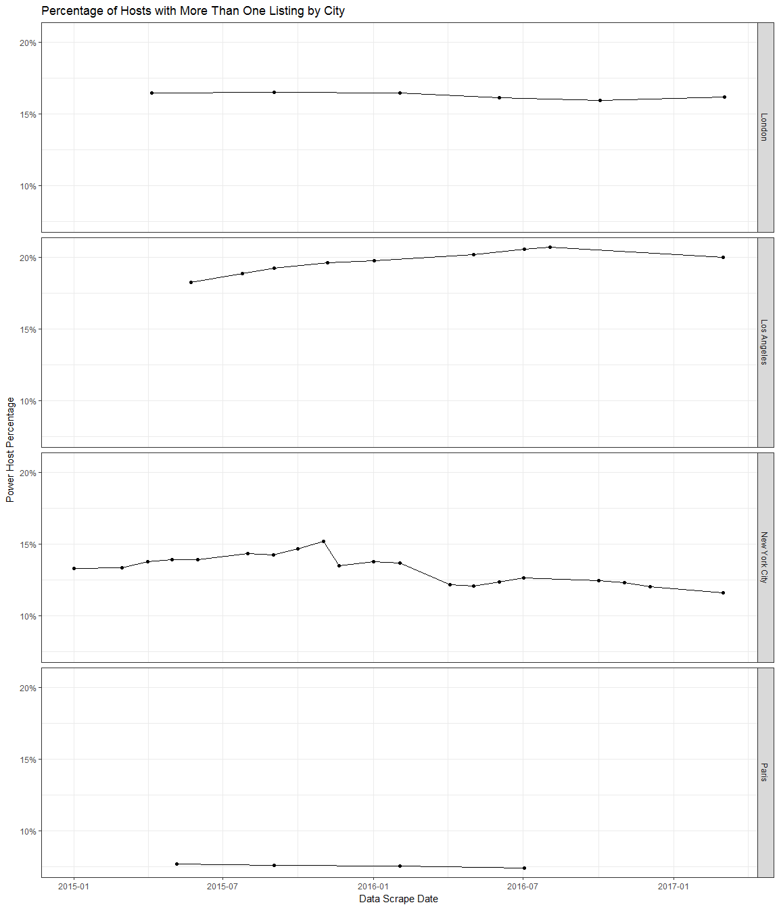

# Airbnb Analysis

## Table of Contents {#toc}

1. [Summary](#summary)
2. [R Environment Information](#environment)
3. [Data Processing I: SQLite](#sqlite)
    + [Overview](#overview-sqlite)
    + [Table Creation](#table-sqlite)
    + [Calendar Load](#calendar-sqlite)
    + [Listings Load](#listings-sqlite)
    + [Reviews Load](#reviews-sqlite)
    + [Index Creation](#index-sqlite)
4. [Data Processing II: MySQL Web Server](#mysql)
    + [Overview](#overview-mysql)
    + [Table Creation](#table-mysql)
    + [Calendar Load](#calendar-mysql)
    + [Listings Load](#listings-mysql)
    + [Reviews Load](#reviews-mysql)
    + [Index Creation](#index-mysql)
5. [Analysis I: Data Investigation](#analysis1)
    + [Overview](#overview-analysis)
    + [Data Scrapes by City Plot](#data-scrapes-plot)
    + [Data Scrapes by City Table](#data-scrapes-table)
6. [Analysis II: Inventory and Hosts](#analysis2)
    + [Listings Growth by City](#listings-growth)
    + [Distinct Host Growth by City](#host-growth)
    + [Percentage of Hosts with More Than One Listing by City](#power-host)
    + [Share of Inventory by Power Host Category](#inv-share)
    + [Property Types](#prop-type)

## Summary {#summary}
([Back to Table of Contents](#toc))

## R Environment Information {#environment}
([Back to Table of Contents](#toc))


```r
# R and system environment information
sys_env <- t(as.data.frame(R.Version()))
colnames(sys_env) <- c('Value')
sys_env
```

```
               Value                         
platform       "x86_64-w64-mingw32"          
arch           "x86_64"                      
os             "mingw32"                     
system         "x86_64, mingw32"             
status         ""                            
major          "3"                           
minor          "3.2"                         
year           "2016"                        
month          "10"                          
day            "31"                          
svn.rev        "71607"                       
language       "R"                           
version.string "R version 3.3.2 (2016-10-31)"
nickname       "Sincere Pumpkin Patch"       
```

## Data Processing (Overview and SQLite Data Transfer) {#sqlite}
([Back to Table of Contents](#toc))

Investigate directory structure of data folder, and create scrape metadata from folder names


```r
# Directory for data folder
data_directory <- 'C:/Airbnb'

# Create data frame for data scrape metadata from folders in the data directory
dir_vec <- list.files(data_directory, recursive = TRUE)
dir_df <- t(data.frame(strsplit(dir_vec, split = '/'), stringsAsFactors = FALSE))
dir_df <- unique(dir_df[, 1:4])
colnames(dir_df) <- c('Country', 'State', 'City', 'DataScrapeDate')
rownames(dir_df) <- seq.int(1, nrow(dir_df))

# Create vector for file sizes
file_size <- file.info(paste(data_directory, '/', dir_vec, sep = ''))$size
```

### Overview {#overview-sqlite}
([Back to Table of Contents](#toc))

All data used in this analysis was downloaded from the [Inside Airbnb](http://insideairbnb.com/) website. Data files are available in the ['Get the Data'](http://insideairbnb.com/get-the-data.html) section of the website. This analysis uses the listings ('listings.csv.gz'), calendar ('calendar.csv.gz'), and reviews ('reviews.csv.gz') files.

Data files were downloaded from the [Inside Airbnb](http://insideairbnb.com/) website and placed in a local directory, with a child-folder structure of [Country]/[State]/[City]/[Data Scrape Date ('YYYY-MM-DD')]/[GZ File]. The directory structure used the city, state, and country names from the headers of each scraped city on the ['Get the Data'](http://insideairbnb.com/get-the-data.html) page of the [Inside Airbnb](http://insideairbnb.com/) website. All files for all scrapes of all cities were downloaded as of **March 15, 2017**, barring the December 02, 2015 scrape of New York City (this scrape contained a broken link for the calendar file). This data encompassed **136** data scrapes for **43** distinct cities. Older scrapes for each city can be removed to cut down on the data size substantially.

This code uses the directory structure of the data folder to construct the metadata for the scraped data. It is therefore imperative that the directory structure is properly set-up. The listings, calendar, and reviews files must retain their original file names.

For this first step in the data processing, the data is placed into a local SQLite database. The remaining analysis can either be performed on this SQLite database, or the data can be transferred to another store (e.g. a MySQL server on an AWS RDS instance). Total disk space for the gz files (**408** files total) is about **6.95** GBs. Total disk space for the complete SQLite database should end up around **71.6** GBs, including the optional indices.


```r
library('RSQLite')
library('DBI')
```


```r
# Directory and file for SQLite database
sqlite_directory <- 'C:/SQLite/Databases/Airbnb.sqlite3'
```

Connect to or create the SQLite database and build the tables if they do not exist


```r
# Connect to or create SQLite database
abnb_db <- dbConnect(SQLite(), sqlite_directory)
```

### Table Creation {#table-sqlite}
([Back to Table of Contents](#toc))


```r
# Create tables if they do not exist
calendar_create <- 'CREATE TABLE IF NOT EXISTS Calendar (
                        Calendar_ID INTEGER PRIMARY KEY AUTOINCREMENT NOT NULL UNIQUE,
                        DataScrape_ID INTEGER NOT NULL,
                        ListingID INTEGER NOT NULL,
                        Date DATE NOT NULL,
                        Available VARCHAR NOT NULL,
                        Price REAL NOT NULL
                    );
                    '
dbExecute(abnb_db, calendar_create)
listings_create <- 'CREATE TABLE IF NOT EXISTS Listings (
                        Listings_ID INTEGER PRIMARY KEY AUTOINCREMENT UNIQUE NOT NULL,
                        DataScrape_ID INTEGER NOT NULL,
                        ID INTEGER NOT NULL,
                        ListingURL VARCHAR,
                        ScrapeID INTEGER,
                        LastSearched DATE,
                        LastScraped DATE,
                        Name TEXT,
                        Summary TEXT,
                        Space TEXT,
                        Description TEXT,
                        ExperiencesOffered TEXT,
                        NeighborhoodOverview TEXT,
                        Notes TEXT,
                        Transit TEXT,
                        Access TEXT,
                        Interaction TEXT,
                        HouseRules TEXT,
                        ThumbnailURL VARCHAR,
                        MediumURL VARCHAR,
                        PictureURL VARCHAR,
                        XLPictureURL VARCHAR,
                        HostID INTEGER,
                        HostURL VARCHAR,
                        HostName VARCHAR,
                        HostSince DATE,
                        HostLocation VARCHAR,
                        HostAbout TEXT,
                        HostResponseTime VARCHAR,
                        HostResponseRate REAL,
                        HostAcceptanceRate REAL,
                        HostIsSuperhost VARCHAR,
                        HostThumbnailURL VARCHAR,
                        HostPictureURL VARCHAR,
                        HostNeighborhood VARCHAR,
                        HostListingsCount INTEGER,
                        HostTotalListingsCount INTEGER,
                        HostVerifications VARCHAR,
                        HostHasProfilePic VARCHAR,
                        HostIdentityVerified VARCHAR,
                        Street VARCHAR,
                        Neighborhood VARCHAR,
                        NeighborhoodCleansed VARCHAR,
                        NeighborhoodGroupCleansed VARCHAR,
                        City VARCHAR,
                        State VARCHAR,
                        ZipCode VARCHAR,
                        Market VARCHAR,
                        SmartLocation VARCHAR,
                        CountryCode VARCHAR,
                        Country VARCHAR,
                        Latitude VARCHAR,
                        Longitude VARCHAR,
                        IsLocationExact VARCHAR,
                        PropertyType VARCHAR,
                        RoomType VARCHAR,
                        Accommodates INTEGER,
                        Bathrooms INTEGER,
                        Bedrooms INTEGER,
                        Beds INTEGER,
                        BedType VARCHAR,
                        Amenities VARCHAR,
                        SquareFeet REAL,
                        Price REAL,
                        WeeklyPrice REAL,
                        MonthlyPrice REAL,
                        SecurityDeposit REAL,
                        CleaningFee REAL,
                        GuestsIncluded INTEGER,
                        ExtraPeople REAL,
                        MinimumNights INTEGER,
                        MaximumNights INTEGER,
                        CalendarUpdated VARCHAR,
                        HasAvailability VARCHAR,
                        Availability30 INTEGER,
                        Availability60 INTEGER,
                        Availability90 INTEGER,
                        Availability365 INTEGER,
                        CalendarLastScraped DATE,
                        NumberOfReviews INTEGER,
                        FirstReview DATE,
                        LastReview DATE,
                        ReviewScoresRating INTEGER,
                        ReviewScoresAccuracy INTEGER,
                        ReviewScoresCleanliness INTEGER,
                        ReviewScoresCheckIn INTEGER,
                        ReviewScoresCommunication INTEGER,
                        ReviewScoresLocation INTEGER,
                        ReviewScoresValue INTEGER,
                        RequiresLicense VARCHAR,
                        License VARCHAR,
                        JurisdictionNames VARCHAR,
                        InstantBookable VARCHAR,
                        CancellationPolicy VARCHAR,
                        RequireGuestProfilePicture VARCHAR,
                        RequireGuestPhoneVerification VARCHAR,
                        RegionID INTEGER,
                        RegionName VARCHAR,
                        RegionParentID INTEGER,
                        CalculatedHostListingsCount INTEGER,
                        ReviewsPerMonth REAL
                    );
                    '
dbExecute(abnb_db, listings_create)
reviews_create <- 'CREATE TABLE IF NOT EXISTS Reviews (
                       Reviews_ID INTEGER PRIMARY KEY AUTOINCREMENT UNIQUE NOT NULL,
                       DataScrape_ID INTEGER NOT NULL,
                       ListingID INTEGER NOT NULL,
                       ID INTEGER NOT NULL,
                       Date DATE NOT NULL,
                       ReviewerID INTEGER NOT NULL,
                       ReviewerName VARCHAR NOT NULL,
                       Comments TEXT NOT NULL
                   );
                   '
dbExecute(abnb_db, reviews_create)
map_data_create <- 'CREATE TABLE IF NOT EXISTS Map_DataScrape (
                        DataScrape_ID INTEGER PRIMARY KEY AUTOINCREMENT UNIQUE NOT NULL,
                        Country VARCHAR NOT NULL,
                        State VARCHAR NOT NULL,
                        City VARCHAR NOT NULL,
                        DataScrapeDate DATE NOT NULL
                    );
                    '
dbExecute(abnb_db, map_data_create)
```

Add unique index to mapping table, to prevent duplication of scrapes in event of multiple runs


```r
idx_datascrape_unique <- 'CREATE UNIQUE INDEX IF NOT EXISTS idx_unique_scrape ON Map_DataScrape (
                              Country
                              ,State
                              ,City
                              ,DataScrapeDate
                          );
                          '
dbExecute(abnb_db, idx_datascrape_unique)
```

Investigate the data scrape metadata


```r
# Return top 20 rows of data scrape metadata
head(dir_df, 20)
```

```
   Country     State              City              DataScrapeDate
1  "Australia" "New South Wales"  "Northern Rivers" "2016-04-02"  
2  "Australia" "New South Wales"  "Sydney"          "2015-05-10"  
3  "Australia" "New South Wales"  "Sydney"          "2015-09-03"  
4  "Australia" "New South Wales"  "Sydney"          "2015-10-02"  
5  "Australia" "New South Wales"  "Sydney"          "2015-12-03"  
6  "Australia" "New South Wales"  "Sydney"          "2016-01-03"  
7  "Australia" "New South Wales"  "Sydney"          "2016-12-04"  
8  "Australia" "New South Wales"  "Sydney"          "2017-03-03"  
9  "Australia" "Victoria"         "Melbourne"       "2015-07-18"  
10 "Australia" "Victoria"         "Melbourne"       "2015-09-03"  
11 "Australia" "Victoria"         "Melbourne"       "2015-10-02"  
12 "Australia" "Victoria"         "Melbourne"       "2015-12-03"  
13 "Australia" "Victoria"         "Melbourne"       "2016-01-03"  
14 "Australia" "Victoria"         "Melbourne"       "2016-09-04"  
15 "Australia" "Victoria"         "Melbourne"       "2016-12-05"  
16 "Austria"   "Vienna"           "Vienna"          "2015-07-18"  
17 "Belgium"   "Brussels"         "Brussels"        "2015-10-03"  
18 "Belgium"   "Flemish Region"   "Antwerp"         "2015-10-03"  
19 "Canada"    "British Columbia" "Vancouver"       "2015-11-07"  
20 "Canada"    "British Columbia" "Vancouver"       "2015-12-03"  
```


```r
# Find max data scrape mapping ID already in the SQLite database
max_scrape_temp <- dbSendQuery(abnb_db, 'SELECT MAX(DataScrape_ID) FROM Map_DataScrape;')
max_scrape <- dbFetch(max_scrape_temp)
dbClearResult(max_scrape_temp)
if (is.na(as.integer(max_scrape))) {max_scrape <- 0} else {max_scrape <- as.integer(max_scrape)}
```

Define column name data frame for listings table (listings files differ from one city and scrape to another -- this step and several steps within the read code for the listings data must be completed in order to maintain consistency across different data files)


```r
# Possible column names for listings data from gz source files
listings_ds_colnames <- c('Listings_ID', 'DataScrape_ID', 'id', 'listing_url', 'scrape_id', 'last_searched',
                          'last_scraped', 'name', 'summary', 'space', 'description', 'experiences_offered',
                          'neighborhood_overview', 'notes', 'transit', 'access', 'interaction', 'house_rules',
                          'thumbnail_url', 'medium_url', 'picture_url', 'xl_picture_url', 'host_id',
                          'host_url', 'host_name', 'host_since', 'host_location', 'host_about',
                          'host_response_time', 'host_response_rate', 'host_acceptance_rate',
                          'host_is_superhost', 'host_thumbnail_url', 'host_picture_url', 'host_neighbourhood',
                          'host_listings_count', 'host_total_listings_count', 'host_verifications',
                          'host_has_profile_pic', 'host_identity_verified', 'street', 'neighbourhood',
                          'neighbourhood_cleansed', 'neighbourhood_group_cleansed', 'city', 'state',
                          'zipcode', 'market', 'smart_location', 'country_code', 'country', 'latitude',
                          'longitude', 'is_location_exact', 'property_type', 'room_type', 'accommodates',
                          'bathrooms', 'bedrooms', 'beds', 'bed_type', 'amenities', 'square_feet', 'price',
                          'weekly_price', 'monthly_price', 'security_deposit', 'cleaning_fee',
                          'guests_included', 'extra_people', 'minimum_nights', 'maximum_nights',
                          'calendar_updated', 'has_availability', 'availability_30', 'availability_60',
                          'availability_90', 'availability_365', 'calendar_last_scraped', 'number_of_reviews',
                          'first_review', 'last_review', 'review_scores_rating', 'review_scores_accuracy',
                          'review_scores_cleanliness', 'review_scores_checkin', 'review_scores_communication',
                          'review_scores_location', 'review_scores_value', 'requires_license', 'license',
                          'jurisdiction_names', 'instant_bookable', 'cancellation_policy',
                          'require_guest_profile_picture', 'require_guest_phone_verification', 'region_id',
                          'region_name', 'region_parent_id', 'calculated_host_listings_count',
                          'reviews_per_month')

# Column names for listings data from the SQLite database
listings_db_colnames <- c('Listings_ID', 'DataScrape_ID', 'ID', 'ListingURL', 'ScrapeID', 'LastSearched',
                          'LastScraped', 'Name', 'Summary', 'Space', 'Description', 'ExperiencesOffered',
                          'NeighborhoodOverview', 'Notes', 'Transit', 'Access', 'Interaction', 'HouseRules',
                          'ThumbnailURL', 'MediumURL', 'PictureURL', 'XLPictureURL', 'HostID',
                          'HostURL', 'HostName', 'HostSince', 'HostLocation', 'HostAbout',
                          'HostResponseTime', 'HostResponseRate', 'HostAcceptanceRate',
                          'HostIsSuperhost', 'HostThumbnailURL', 'HostPictureURL', 'HostNeighborhood',
                          'HostListingsCount', 'HostTotalListingsCount', 'HostVerifications',
                          'HostHasProfilePic', 'HostIdentityVerified', 'Street', 'Neighborhood',
                          'NeighborhoodCleansed', 'NeighborhoodGroupCleansed', 'City', 'State',
                          'ZipCode', 'Market', 'SmartLocation', 'CountryCode', 'Country', 'Latitude',
                          'Longitude', 'IsLocationExact', 'PropertyType', 'RoomType', 'Accommodates',
                          'Bathrooms', 'Bedrooms', 'Beds', 'BedType', 'Amenities', 'SquareFeet', 'Price',
                          'WeeklyPrice', 'MonthlyPrice', 'SecurityDeposit', 'CleaningFee',
                          'GuestsIncluded', 'ExtraPeople', 'MinimumNights', 'MaximumNights',
                          'CalendarUpdated', 'HasAvailability', 'Availability30', 'Availability60',
                          'Availability90', 'Availability365', 'CalendarLastScraped', 'NumberOfReviews',
                          'FirstReview', 'LastReview', 'ReviewScoresRating', 'ReviewScoresAccuracy',
                          'ReviewScoresCleanliness', 'ReviewScoresCheckIn', 'ReviewScoresCommunication',
                          'ReviewScoresLocation', 'ReviewScoresValue', 'RequiresLicense', 'License',
                          'JurisdictionNames', 'InstantBookable', 'CancellationPolicy',
                          'RequireGuestProfilePicture', 'RequireGuestPhoneVerification', 'RegionID',
                          'RegionName', 'RegionParentID', 'CalculatedHostListingsCount',
                          'ReviewsPerMonth')

# Combine gz file data source and SQLite column names for listings data into mapping data frame
listings_df_colnames <- data.frame(listings_ds_colnames, listings_db_colnames)
```

Loop through all directories (as defined in dir_df matrix), read all gz files, and populate data into the SQLite database

### Calendar Load {#calendar-sqlite}
([Back to Table of Contents](#toc))


```r
# Read calendar data and populate into SQLite database
loop <- 1 + max_scrape
while (loop <= (max_scrape + nrow(dir_df))) {
    # Repair columns if broken
    calendar_temp <- readLines(paste(data_directory, '/', dir_df[loop, 1], '/',
                                     dir_df[loop, 2], '/', dir_df[loop, 3], '/',
                                     dir_df[loop, 4], '/calendar.csv.gz', sep = ''))
    # Replace two consecutive double quotes with one double quote and wrap currency figures in a double quote
    calendar_temp <- gsub('""', '"', gsub('([$][0-9,.]+)', '"\\1"', calendar_temp))
    # Write temp data to temporary file
    write(calendar_temp, file = 'temp.txt', ncolumns = 1)
    # Prepare calendar data frame
    calendar <- read.table('temp.txt', sep = ',', quote = '"', header = TRUE, comment.char = '',
                           stringsAsFactors = FALSE)
    # Remove NAs (interpreted as NULL)
    calendar[is.na(calendar)] <- ''
    # Create extra data rows
    cal_length <- nrow(calendar)
    id_vec_cal <- rep(NA, cal_length)
    map_id_vec_cal <- rep(loop, cal_length)
    # Bind data frame
    calendar <- cbind.data.frame(id_vec_cal, map_id_vec_cal, calendar)
    # Set column names
    names(calendar) <- c('Calendar_ID', 'DataScrape_ID', 'ListingID', 'Date', 'Available', 'Price')
    # Strip dollar signs and commas from prices
    calendar$Price <- gsub(',', '', gsub('\\$', '', calendar$Price))
    # Write calendar data frame to SQLite database
    dbWriteTable(abnb_db, name = 'Calendar', value = calendar, append = TRUE)
    
    # Increment loop
    loop <- loop + 1
}

# Remove temp file and large objects
if (file.exists('temp.txt')) {file.remove('temp.txt')}
if (exists('calendar_temp')) {rm(calendar_temp)}
if (exists('calendar')) {rm(calendar)}
```

### Listings Load {#listings-sqlite}
([Back to Table of Contents](#toc))


```r
# Read listings data and populate into SQLite database
loop <- 1 + max_scrape
while (loop <= (max_scrape + nrow(dir_df))) {
    # Repair columns if broken
    listings_temp <- readLines(paste(data_directory, '/', dir_df[loop, 1], '/',
                                     dir_df[loop, 2], '/', dir_df[loop, 3], '/',
                                     dir_df[loop, 4], '/listings.csv.gz', sep = ''))
    # Fix quoting characters and replace two consecutive double quotes with a single quote
    listings_temp <- gsub(',\'"', ',"\'', gsub('""', '\'', listings_temp))
    # Write temp data to temporary file
    write(listings_temp, file = 'temp.txt', ncolumns = 1)
    # Prepare listings data frame
    listings <- read.table('temp.txt', sep = ',', quote = '"', header = TRUE, comment.char = '',
                           stringsAsFactors = FALSE)
    # Remove NAs (interpreted as NULL)
    listings[is.na(listings)] <- ''
    # Create extra data rows
    lst_length <- nrow(listings)
    id_vec_lst <- rep(NA, lst_length)
    map_id_vec_lst <- rep(loop, lst_length)
    # Add extra data rows to data frame
    listings['Listings_ID'] <- id_vec_lst
    listings['DataScrape_ID'] <- map_id_vec_lst
    # Set column names
    i <- 1
    while (i <= length(names(listings))) {
        names(listings)[i] <- as.character(listings_df_colnames$listings_db_colnames
                                           [match(names(listings)[i],
                                                  listings_df_colnames$listings_ds_colnames)])
        i <- i + 1
    }
    # Fill in missing columns with NA
    i <- 1
    while (i <= length(listings_df_colnames$listings_db_colnames)) {
        if (!is.element(listings_df_colnames$listings_db_colnames[i], names(listings))) {
            temp_vec <- rep(NA, lst_length)
            listings[as.character(listings_df_colnames$listings_db_colnames[i])] <- temp_vec
        }
        i <- i + 1
    }
    # Reorder data frame
    i <- 1
    name_vec <- vector(mode = 'integer')
    while (i <= length(listings_df_colnames$listings_db_colnames)) {
        name_vec[i] <- match(listings_df_colnames$listings_db_colnames[i], names(listings))
        i <- i + 1
    }
    listings <- listings[name_vec]
    # Strip dollar signs and commas from prices
    listings$Price <- gsub(',', '', gsub('\\$', '', listings$Price))
    listings$WeeklyPrice <- gsub(',', '', gsub('\\$', '', listings$WeeklyPrice))
    listings$MonthlyPrice <- gsub(',', '', gsub('\\$', '', listings$MonthlyPrice))
    listings$SecurityDeposit <- gsub(',', '', gsub('\\$', '', listings$SecurityDeposit))
    listings$CleaningFee <- gsub(',', '', gsub('\\$', '', listings$CleaningFee))
    listings$ExtraPeople <- gsub(',', '', gsub('\\$', '', listings$ExtraPeople))
    # Strip percent signs
    listings$HostResponseRate <- gsub('%', '', listings$HostResponseRate)
    listings$HostAcceptanceRate <- gsub('%', '', listings$HostAcceptanceRate)
    # Write listings data frame to SQLite database
    dbWriteTable(abnb_db, name = 'Listings', value = listings, append = TRUE)
    
    # Increment loop
    loop <- loop + 1
}

# Remove temp file and large objects
if (file.exists('temp.txt')) {file.remove('temp.txt')}
if (exists('listings_temp')) {rm(listings_temp)}
if (exists('listings')) {rm(listings)}
```

### Reviews Load {#reviews-sqlite}
([Back to Table of Contents](#toc))


```r
# Read reviews data and populate into SQLite database
loop <- 1 + max_scrape
while (loop <= (max_scrape + nrow(dir_df))) {
    # Prepare reviews data frame
    reviews <- read.table(paste(data_directory, '/', dir_df[loop, 1], '/',
                                dir_df[loop, 2], '/', dir_df[loop, 3], '/',
                                dir_df[loop, 4], '/reviews.csv.gz', sep = ''),
                          sep = ',', quote = '"', header = TRUE, comment.char = '',
                          stringsAsFactors = FALSE)
    reviews[is.na(reviews)] <- ''
    # Create extra data rows
    rvw_length <- nrow(reviews)
    id_vec_rvw <- rep(NA, rvw_length)
    map_id_vec_rvw <- rep(loop, rvw_length)
    # Bind data frame
    reviews <- cbind.data.frame(id_vec_rvw, map_id_vec_rvw, reviews)
    # Set column names
    names(reviews) <- c('Reviews_ID', 'DataScrape_ID', 'ListingID', 'ID', 'Date', 'ReviewerID',
                        'ReviewerName', 'Comments')
    # Write reviews data frame to SQLite database
    dbWriteTable(abnb_db, name = 'Reviews', value = reviews, append = TRUE)
    
    # Increment loop
    loop <- loop + 1
}

# Remove large objects
if (exists('reviews')) {rm(reviews)}
```


```r
# Create data scrape mapping table
scrape_seq <- seq(1 + max_scrape, (max_scrape + nrow(dir_df)))
data_scrape <- cbind.data.frame(scrape_seq, dir_df)
# Set column names
colnames(data_scrape) <- c('DataScrape_ID', 'Country', 'State', 'City', 'DataScrapeDate')
# Write data scrape mapping data frame to SQLite database
dbWriteTable(abnb_db, name = 'Map_DataScrape', value = data_scrape, append = TRUE, row.names = FALSE)
```

### Index Creation {#index-sqlite}
([Back to Table of Contents](#toc))

**Optional:** Create database indices for faster querying


```r
# Data scrape ID indices
idx_datascrape_id <- 'CREATE INDEX IF NOT EXISTS idx_DataScrape_ID ON Map_DataScrape (
                          DataScrape_ID
                      );
                      '
dbExecute(abnb_db, idx_datascrape_id)
idx_datascrape_id_cal <- 'CREATE INDEX IF NOT EXISTS idx_DataScrape_ID_cal ON Calendar (
                              DataScrape_ID
                          );
                          '
dbExecute(abnb_db, idx_datascrape_id_cal)
idx_datascrape_id_lst <- 'CREATE INDEX IF NOT EXISTS idx_DataScrape_ID_lst ON Listings (
                              DataScrape_ID
                          );
                          '
dbExecute(abnb_db, idx_datascrape_id_lst)
idx_datascrape_id_rvw <- 'CREATE INDEX IF NOT EXISTS idx_DataScrape_ID_rvw ON Reviews (
                              DataScrape_ID
                          );
                          '
dbExecute(abnb_db, idx_datascrape_id_rvw)

# Listing ID indices
idx_listing_id_cal <- 'CREATE INDEX IF NOT EXISTS idx_Listing_ID_cal ON Calendar (
                           ListingID
                       );
                       '
dbExecute(abnb_db, idx_listing_id_cal)
idx_listing_id_lst <- 'CREATE INDEX IF NOT EXISTS idx_Listing_ID_lst ON Listings (
                           ID
                       );
                       '
dbExecute(abnb_db, idx_listing_id_lst)
idx_listing_id_rvw <- 'CREATE INDEX IF NOT EXISTS idx_Listing_ID_rvw ON Reviews (
                           ListingID
                       );
                       '
dbExecute(abnb_db, idx_listing_id_rvw)
```

Disconnect from the SQLite database


```r
# Disconnect from SQLite database
dbDisconnect(abnb_db)
```

## Data Processing (AWS MySQL RDS Instance Data Transfer) {#mysql}
([Back to Table of Contents](#toc))

### Overview {#overview-mysql}
([Back to Table of Contents](#toc))

Although merging all bz files into a SQLite database with the proper metadata enables significantly streamlined analysis, this approach towards data management carries significant downsides. The data takes up a large amount of space and is stored twice on disk (once in the assortment of gz files and once in the SQLite database). The analysis is limited by the processing power and memory of the user's computer. Finally, the SQLite database is serverless and therefore must be transferred to another user's computer in order to facilitate data sharing.

Transferring the data to a server-based RDBMS solves these problems. Below, the data from the SQLite database will be moved to a MySQL server on an AWS RDS instance owned by the analysis author. There is no need for the SQLite database to server as an intermediary, however. In this analysis, the data will be moved out of the SQLite database and into the MySQL server simply to reduce duplication of code. Below are documented the steps required to alter the code in the 'Data Processing' sections of this analysis to move the data straight from the bz files into the MySQL server.

1. Replace all table and index creation statements with the equivalent MySQL statements documented below.
2. Replace the statement used to create the max_scrape variable with the equivalent MySQL statement documented below.
3. Perform the following modifications to the read and populate blocks for the calendar, listings, reviews, and data scrape code blocks:
    + Remove all calls to dbWriteTable.
    + In place of the dbWriteTable calls, write the final dataframes to a text file. Make sure to replace all new line, carriage return, and tab characters in fields where these can occur (see statements below to identify the applicable fields).
    + Some fields will require replacement logic to make the output compatible with MySQL data types (see statements below to identify the applicable fields). SQLite accepts any value of any length in any column, regardless of the column data type. The SELECT statements must therefore contain logic which transforms the output into data that MySQL can upload without producing warnings.
    + Execute LOAD DATA LOCAL INFILE statements on the MySQL server using these files (see statements below for examples).
    + Additional work may need to be done to handle differences in how MySQL handles NULL fields (concerning how R writes NA values to text files and how MySQL reads the resulting data, and how MySQL handles NULL values for auto-increment NOT NULL columns).


```r
library('RSQLite')
library('RMySQL')
library('DBI')
```

Connect to the SQLite and MySQL databases


```r
# Directory and file for SQLite database
sqlite_directory <- 'C:/SQLite/Databases/Airbnb.sqlite3'

# Connect to SQLite database
abnb_db_slt <- dbConnect(SQLite(), sqlite_directory)

# Load MySQL server address and log-in credentials (replace with your server address and log-in credentials)
mysql_server_address <- readLines('C:/Credentials/AWS MySQL Airbnb Database/serverAddress.txt')
mysql_user_name <- readLines('C:/Credentials/AWS MySQL Airbnb Database/userName.txt')
mysql_password <- readLines('C:/Credentials/AWS MySQL Airbnb Database/password.txt')

# Connect to MySQL database -- this instance has been launched with a database named 'airbnb'
abnb_db_mys <- dbConnect(MySQL(), dbname = 'airbnb', username = mysql_user_name, password = mysql_password,
                         host = mysql_server_address)
```

### Table Creation {#table-mysql}
([Back to Table of Contents](#toc))

Create the MySQL tables if they do not exist  
Field sizes were determined by manually investigating the maximum values (for integer or decimal fields) or the maximum character lengths (for varchar fields) in the SQLite database. Future data may require modifications to the table structure to prevent truncation of data.


```r
# Create tables if they do not exist
calendar_create <- 'CREATE TABLE IF NOT EXISTS airbnb.Calendar (
                        Calendar_ID INT NOT NULL AUTO_INCREMENT,
                        DataScrape_ID INT NOT NULL,
                        ListingID INT NOT NULL,
                        Date DATE NOT NULL,
                        Available VARCHAR(1) NOT NULL,
                        Price DECIMAL(9, 2),
                        PRIMARY KEY (Calendar_ID)
                    );
                    '
dbExecute(abnb_db_mys, calendar_create)
listings_create <- 'CREATE TABLE IF NOT EXISTS airbnb.Listings (
                        Listings_ID INT NOT NULL AUTO_INCREMENT,
                        DataScrape_ID INT NOT NULL,
                        ID INT NOT NULL,
                        ListingURL VARCHAR(45),
                        ScrapeID BIGINT,
                        LastSearched DATE,
                        LastScraped DATE,
                        Name VARCHAR(300),
                        Summary VARCHAR(2300),
                        Space VARCHAR(3000),
                        Description VARCHAR(3000),
                        ExperiencesOffered VARCHAR(45),
                        NeighborhoodOverview VARCHAR(3000),
                        Notes VARCHAR(3000),
                        Transit VARCHAR(3000),
                        Access VARCHAR(3000),
                        Interaction VARCHAR(3000),
                        HouseRules VARCHAR(3000),
                        ThumbnailURL VARCHAR(200),
                        MediumURL VARCHAR(200),
                        PictureURL VARCHAR(200),
                        XLPictureURL VARCHAR(200),
                        HostID INT,
                        HostURL VARCHAR(120),
                        HostName VARCHAR(200),
                        HostSince DATE,
                        HostLocation VARCHAR(300),
                        HostAbout VARCHAR(20000),
                        HostResponseTime VARCHAR(45),
                        HostResponseRate INT,
                        HostAcceptanceRate INT,
                        HostIsSuperhost VARCHAR(1),
                        HostThumbnailURL VARCHAR(200),
                        HostPictureURL VARCHAR(200),
                        HostNeighborhood VARCHAR(300),
                        HostListingsCount INT,
                        HostTotalListingsCount INT,
                        HostVerifications VARCHAR(200),
                        HostHasProfilePic VARCHAR(1),
                        HostIdentityVerified VARCHAR(1),
                        Street VARCHAR(300),
                        Neighborhood VARCHAR(300),
                        NeighborhoodCleansed VARCHAR(120),
                        NeighborhoodGroupCleansed VARCHAR(45),
                        City VARCHAR(300),
                        State VARCHAR(120),
                        ZipCode VARCHAR(70),
                        Market VARCHAR(70),
                        SmartLocation VARCHAR(300),
                        CountryCode VARCHAR(10),
                        Country VARCHAR(25),
                        Latitude VARCHAR(25),
                        Longitude VARCHAR(25),
                        IsLocationExact VARCHAR(1),
                        PropertyType VARCHAR(25),
                        RoomType VARCHAR(25),
                        Accommodates INT,
                        Bathrooms INT,
                        Bedrooms INT,
                        Beds INT,
                        BedType VARCHAR(25),
                        Amenities VARCHAR(800),
                        SquareFeet DECIMAL(8, 2),
                        Price DECIMAL(9, 2),
                        WeeklyPrice DECIMAL(10, 2),
                        MonthlyPrice DECIMAL(11, 2),
                        SecurityDeposit DECIMAL(9, 2),
                        CleaningFee DECIMAL(8, 2),
                        GuestsIncluded INT,
                        ExtraPeople DECIMAL(8, 2),
                        MinimumNights INT,
                        MaximumNights INT,
                        CalendarUpdated VARCHAR(25),
                        HasAvailability VARCHAR(1),
                        Availability30 INT,
                        Availability60 INT,
                        Availability90 INT,
                        Availability365 INT,
                        CalendarLastScraped DATE,
                        NumberOfReviews INT,
                        FirstReview DATE,
                        LastReview DATE,
                        ReviewScoresRating INT,
                        ReviewScoresAccuracy INT,
                        ReviewScoresCleanliness INT,
                        ReviewScoresCheckIn INT,
                        ReviewScoresCommunication INT,
                        ReviewScoresLocation INT,
                        ReviewScoresValue INT,
                        RequiresLicense VARCHAR(1),
                        License VARCHAR(600),
                        JurisdictionNames VARCHAR(120),
                        InstantBookable VARCHAR(1),
                        CancellationPolicy VARCHAR(25),
                        RequireGuestProfilePicture VARCHAR(1),
                        RequireGuestPhoneVerification VARCHAR(1),
                        RegionID INT,
                        RegionName VARCHAR(25),
                        RegionParentID INT,
                        CalculatedHostListingsCount INT,
                        ReviewsPerMonth DECIMAL(4, 2),
                        PRIMARY KEY (Listings_ID)
                    );
                    '
dbExecute(abnb_db_mys, listings_create)
reviews_create <- 'CREATE TABLE IF NOT EXISTS airbnb.Reviews (
                       Reviews_ID INT NOT NULL AUTO_INCREMENT,
                       DataScrape_ID INT NOT NULL,
                       ListingID INT NOT NULL,
                       ID INT NOT NULL,
                       Date DATE NOT NULL,
                       ReviewerID INT NOT NULL,
                       ReviewerName VARCHAR(300) NOT NULL,
                       Comments VARCHAR(14000) NOT NULL,
                       PRIMARY KEY (Reviews_ID)
                   );
                   '
dbExecute(abnb_db_mys, reviews_create)
map_data_create <- 'CREATE TABLE IF NOT EXISTS airbnb.Map_DataScrape (
                        DataScrape_ID INT NOT NULL AUTO_INCREMENT,
                        Country VARCHAR(25) NOT NULL,
                        State VARCHAR(35) NOT NULL,
                        City VARCHAR(25) NOT NULL,
                        DataScrapeDate DATE NOT NULL,
                        PRIMARY KEY (DataScrape_ID)
                    );
                    '
dbExecute(abnb_db_mys, map_data_create)
```

Add unique index to mapping table, to prevent duplication of scrapes in event of multiple runs  
MySQL has no CREATE INDEX IF NOT EXISTS functionality, so do not run this code chunk if the index already exists.


```r
idx_datascrape_unique <- 'CREATE UNIQUE INDEX idx_unique_scrape ON airbnb.Map_DataScrape (
                              Country
                              ,State
                              ,City
                              ,DataScrapeDate
                          );
                          '
dbExecute(abnb_db_mys, idx_datascrape_unique)
```


```r
# Find max data scrape mapping ID already in the MySQL database
max_scrape_temp <- dbSendQuery(abnb_db_mys, 'SELECT MAX(DataScrape_ID) FROM airbnb.Map_DataScrape;')
max_scrape <- dbFetch(max_scrape_temp)
dbClearResult(max_scrape_temp)
if (is.na(as.integer(max_scrape))) {max_scrape <- 0} else {max_scrape <- as.integer(max_scrape)}
```

The process of moving data from the SQLite database into the MySQL server will involve writing the SQLite data to a text file and then calling a LOAD DATA LOCAL INFILE command on the MySQL server which will read the data in the text file. The data will be transferred in batches to allow us to pick up where we left off if we only want to transfer some of the data or if the transfer process fails in the middle of the loop.

First, we must find how many rows are in each of the three large tables (Calendar, Listings, and Reviews) in the SQLite database. This will tell us how long to run our loops. Then we can begin writing the data from the SQLite database and reading it into the MySQL server.


```r
# Find row count of large tables
table_rows_temp <- dbSendQuery(abnb_db_slt, 'SELECT COUNT(*) AS RowCount FROM Calendar
                                             UNION ALL
                                             SELECT COUNT(*) AS RowCount FROM Listings
                                             UNION ALL
                                             SELECT COUNT(*) AS RowCount FROM Reviews;')
table_rows <- dbFetch(table_rows_temp)
invisible(dbClearResult(table_rows_temp))
rownames(table_rows) <- c('Calendar', 'Listings', 'Reviews')
table_rows
```

```
          RowCount
Calendar 702590690
Listings   1924970
Reviews   25220866
```

Because the Calendar table is narrow, we can transfer it in batches of five million. The Reviews table can be transferred in batches of half a million. The wider Listings table will be transferred in batches of 100,000.


```r
work_dir_stem <- getwd()
```

### Calendar Load {#calendar-mysql}
([Back to Table of Contents](#toc))


```r
loop <- 0
batch_size <- 5000000
work_dir <- paste(work_dir_stem, '/calendar_transf.txt', sep = '')
while (loop < table_rows[1, 1]) {
    # Query Calendar table
    calendar_sql <- 'SELECT
                         Calendar_ID
                         ,DataScrape_ID
                         ,ListingID
                         ,Date
                         ,Available
                         ,CASE WHEN Price = \'\' THEN \'NULLTYPE\' ELSE CAST(Price AS TEXT) END AS Price
                     FROM Calendar
                     LIMIT '
    calendar_rows_temp <- dbSendQuery(abnb_db_slt, paste(calendar_sql, format(loop, scientific = FALSE), ', ',
                                                         format(batch_size, scientific = FALSE), ';',
                                                         sep = ''))
    calendar_rows <- dbFetch(calendar_rows_temp)
    dbClearResult(calendar_rows_temp)
    
    # Write results to temp file
    write.table(calendar_rows, file = 'calendar_transf.txt', quote = FALSE, sep = '|', row.names = FALSE,
                col.names = FALSE)
    
    # Read results into MySQL from temp file
    calendar_load_stem1 <- 'LOAD DATA LOCAL INFILE \''
    calendar_load_stem2 <- '\' INTO TABLE airbnb.Calendar
                            FIELDS TERMINATED BY \'|\'
                            LINES TERMINATED BY \'\r\n\'
                            (Calendar_ID, DataScrape_ID, ListingID, Date, Available, @var1)
                            SET Price = IF(@var1 = \'NULLTYPE\', NULL, @var1);'
    calendar_load <- dbSendStatement(abnb_db_mys, paste(calendar_load_stem1, work_dir, calendar_load_stem2,
                                                        sep = ''))
    dbClearResult(calendar_load)
    
    loop <- loop + batch_size
}

# Remove temp file and large objects
if (file.exists('calendar_transf.txt')) {file.remove('calendar_transf.txt')}
if (exists('calendar_rows')) {rm(calendar_rows)}
```

### Listings Load {#listings-mysql}
([Back to Table of Contents](#toc))


```r
loop <- 0
batch_size <- 100000
work_dir <- paste(work_dir_stem, '/listings_transf.txt', sep = '')
while (loop < table_rows[2, 1]) {
    # Query Listings table
    # Replace all characters that might interfere with data transfer and properly label NULLs
    listings_sql <- 'SELECT
                         Listings_ID
                         ,DataScrape_ID
                         ,ID
                         ,CASE WHEN ListingURL IS NULL THEN \'NULLTYPE\' ELSE ListingURL END AS ListingURL
                         ,ScrapeID
                         ,CASE
                             WHEN LastSearched IS NULL OR LastSearched = \'\'
                             THEN \'NULLTYPE\'
                             ELSE CAST(LastSearched AS TEXT) END AS LastSearched
                         ,LastScraped
                         ,REPLACE(REPLACE(REPLACE(REPLACE(REPLACE(REPLACE(REPLACE(Name, CHAR(9), \' \'),
                             CHAR(10), \' \'), CHAR(11), \'\'), CHAR(13), \' \'), CHAR(8), \'\'),
                             \'|\', \'-\'), CHAR(92), \'-\') AS Name
                         ,CASE
                             WHEN Summary IS NULL
                             THEN \'NULLTYPE\'
                             ELSE REPLACE(REPLACE(REPLACE(REPLACE(REPLACE(REPLACE(REPLACE(Summary,
                                 CHAR(9), \' \'), CHAR(10), \' \'), CHAR(11), \'\'), CHAR(13), \' \'),
                                 CHAR(8), \'\'), \'|\', \'-\'), CHAR(92), \'-\') END AS Summary
                         ,CASE
                             WHEN Space IS NULL
                             THEN \'NULLTYPE\'
                             ELSE REPLACE(REPLACE(REPLACE(REPLACE(REPLACE(REPLACE(REPLACE(Space,
                                 CHAR(9), \' \'), CHAR(10), \' \'), CHAR(11), \'\'), CHAR(13), \' \'),
                                 CHAR(8), \'\'), \'|\', \'-\'), CHAR(92), \'-\') END AS Space
                         ,CASE
                             WHEN Description IS NULL
                             THEN \'NULLTYPE\'
                             ELSE REPLACE(REPLACE(REPLACE(REPLACE(REPLACE(REPLACE(REPLACE(Description,
                                 CHAR(9), \' \'), CHAR(10), \' \'), CHAR(11), \'\'), CHAR(13), \' \'),
                                 CHAR(8), \'\'), \'|\', \'-\'), CHAR(92), \'-\') END AS Description
                         ,CASE
                             WHEN ExperiencesOffered IS NULL
                             THEN \'NULLTYPE\'
                             ELSE ExperiencesOffered END AS ExperiencesOffered
                         ,CASE
                             WHEN NeighborhoodOverview IS NULL
                             THEN \'NULLTYPE\'
                             ELSE REPLACE(REPLACE(REPLACE(REPLACE(REPLACE(REPLACE(REPLACE(
                                 NeighborhoodOverview, CHAR(9), \' \'), CHAR(10), \' \'), CHAR(11), \'\'),
                                 CHAR(13), \' \'), CHAR(8), \'\'), \'|\', \'-\'), CHAR(92), \'-\') END AS
                                 NeighborhoodOverview
                         ,CASE
                             WHEN Notes IS NULL
                             THEN \'NULLTYPE\'
                             ELSE REPLACE(REPLACE(REPLACE(REPLACE(REPLACE(REPLACE(REPLACE(Notes,
                                 CHAR(9), \' \'), CHAR(10), \' \'), CHAR(11), \'\'), CHAR(13), \' \'),
                                 CHAR(8), \'\'), \'|\', \'-\'), CHAR(92), \'-\') END AS Notes
                         ,CASE
                             WHEN Transit IS NULL
                             THEN \'NULLTYPE\'
                             ELSE REPLACE(REPLACE(REPLACE(REPLACE(REPLACE(REPLACE(REPLACE(Transit,
                                 CHAR(9), \' \'), CHAR(10), \' \'), CHAR(11), \'\'), CHAR(13), \' \'),
                                 CHAR(8), \'\'), \'|\', \'-\'), CHAR(92), \'-\') END AS Transit
                         ,CASE
                             WHEN Access IS NULL
                             THEN \'NULLTYPE\'
                             ELSE REPLACE(REPLACE(REPLACE(REPLACE(REPLACE(REPLACE(REPLACE(Access,
                                 CHAR(9), \' \'), CHAR(10), \' \'), CHAR(11), \'\'), CHAR(13), \' \'),
                                 CHAR(8), \'\'), \'|\', \'-\'), CHAR(92), \'-\') END AS Access
                         ,CASE
                             WHEN Interaction IS NULL
                             THEN \'NULLTYPE\'
                             ELSE REPLACE(REPLACE(REPLACE(REPLACE(REPLACE(REPLACE(REPLACE(Interaction,
                                 CHAR(9), \' \'), CHAR(10), \' \'), CHAR(11), \'\'), CHAR(13), \' \'),
                                 CHAR(8), \'\'), \'|\', \'-\'), CHAR(92), \'-\') END AS Interaction
                         ,CASE
                             WHEN HouseRules IS NULL
                             THEN \'NULLTYPE\'
                             ELSE REPLACE(REPLACE(REPLACE(REPLACE(REPLACE(REPLACE(REPLACE(HouseRules,
                                 CHAR(9), \' \'), CHAR(10), \' \'), CHAR(11), \'\'), CHAR(13), \' \'),
                                 CHAR(8), \'\'), \'|\', \'-\'), CHAR(92), \'-\') END AS HouseRules
                         ,CASE
                             WHEN ThumbnailURL IS NULL
                             THEN \'NULLTYPE\'
                             ELSE ThumbnailURL END AS ThumbnailURL
                         ,CASE WHEN MediumURL IS NULL THEN \'NULLTYPE\' ELSE MediumURL END AS MediumURL
                         ,PictureURL
                         ,CASE
                             WHEN XLPictureURL IS NULL
                             THEN \'NULLTYPE\'
                             ELSE XLPictureURL END AS XLPictureURL
                         ,HostID
                         ,CASE WHEN HostURL IS NULL THEN \'NULLTYPE\' ELSE HostURL END AS HostURL
                         ,REPLACE(REPLACE(REPLACE(REPLACE(REPLACE(REPLACE(REPLACE(HostName, CHAR(9), \' \'),
                             CHAR(10), \' \'), CHAR(11), \'\'), CHAR(13), \' \'), CHAR(8), \'\'),
                             \'|\', \'-\'), CHAR(92), \'-\') AS HostName
                         ,CASE
                             WHEN HostSince = \'\'
                             THEN \'NULLTYPE\'
                             ELSE CAST(HostSince AS TEXT) END AS HostSince
                         ,CASE
                             WHEN HostLocation IS NULL
                             THEN \'NULLTYPE\'
                             ELSE REPLACE(REPLACE(REPLACE(REPLACE(REPLACE(REPLACE(REPLACE(HostLocation,
                                 CHAR(9), \' \'), CHAR(10), \' \'), CHAR(11), \'\'), CHAR(13), \' \'),
                                 CHAR(8), \'\'), \'|\', \'-\'), CHAR(92), \'-\') END AS HostLocation
                         ,CASE
                             WHEN HostAbout IS NULL
                             THEN \'NULLTYPE\'
                             ELSE REPLACE(REPLACE(REPLACE(REPLACE(REPLACE(REPLACE(REPLACE(HostAbout,
                                 CHAR(9), \' \'), CHAR(10), \' \'), CHAR(11), \'\'), CHAR(13), \' \'),
                                 CHAR(8), \'\'), \'|\', \'-\'), CHAR(92), \'-\') END AS HostAbout
                         ,CASE
                             WHEN HostResponseTime IS NULL
                             THEN \'NULLTYPE\'
                             ELSE HostResponseTime END AS HostResponseTime
                         ,CASE
                             WHEN HostResponseRate IS NULL OR HostResponseRate IN (\'\', \'N/A\')
                             THEN \'NULLTYPE\'
                             ELSE CAST(HostResponseRate AS TEXT) END AS HostResponseRate
                         ,CASE
                             WHEN HostAcceptanceRate IS NULL OR HostAcceptanceRate IN (\'\', \'N/A\')
                             THEN \'NULLTYPE\'
                             ELSE CAST(HostAcceptanceRate AS TEXT) END AS HostAcceptanceRate
                         ,CASE
                             WHEN HostIsSuperhost IS NULL
                             THEN \'NULLTYPE\'
                             ELSE HostIsSuperhost END AS HostIsSuperhost
                         ,CASE
                             WHEN HostThumbnailURL IS NULL
                             THEN \'NULLTYPE\'
                             ELSE HostThumbnailURL END AS HostThumbnailURL
                         ,HostPictureURL
                         ,CASE
                             WHEN HostNeighborhood IS NULL
                             THEN \'NULLTYPE\'
                             ELSE REPLACE(REPLACE(REPLACE(REPLACE(REPLACE(REPLACE(REPLACE(HostNeighborhood,
                                 CHAR(9), \' \'), CHAR(10), \' \'), CHAR(11), \'\'), CHAR(13), \' \'),
                                 CHAR(8), \'\'), \'|\', \'-\'), CHAR(92), \'-\') END AS HostNeighborhood
                         ,CASE
                             WHEN HostListingsCount IS NULL OR HostListingsCount = \'\'
                             THEN \'NULLTYPE\'
                             ELSE CAST(HostListingsCount AS TEXT) END AS HostListingsCount
                         ,CASE
                             WHEN HostTotalListingsCount IS NULL OR HostTotalListingsCount = \'\'
                             THEN \'NULLTYPE\'
                             ELSE CAST(HostTotalListingsCount AS TEXT) END AS HostTotalListingsCount
                         ,CASE
                             WHEN HostVerifications IS NULL
                             THEN \'NULLTYPE\'
                             ELSE HostVerifications END AS HostVerifications
                         ,CASE
                             WHEN HostHasProfilePic IS NULL
                             THEN \'NULLTYPE\'
                             ELSE HostHasProfilePic END AS HostHasProfilePic
                         ,CASE
                             WHEN HostIdentityVerified IS NULL
                             THEN \'NULLTYPE\'
                             ELSE HostIdentityVerified END AS HostIdentityVerified
                         ,REPLACE(REPLACE(REPLACE(REPLACE(REPLACE(REPLACE(REPLACE(Street, CHAR(9), \' \'),
                             CHAR(10), \' \'), CHAR(11), \'\'), CHAR(13), \' \'), CHAR(8), \'\'),
                             \'|\', \'-\'), CHAR(92), \'-\') AS Street
                         ,REPLACE(REPLACE(REPLACE(REPLACE(REPLACE(REPLACE(REPLACE(Neighborhood,
                             CHAR(9), \' \'), CHAR(10), \' \'), CHAR(11), \'\'), CHAR(13), \' \'),
                             CHAR(8), \'\'), \'|\', \'-\'), CHAR(92), \'-\') AS Neighborhood
                         ,REPLACE(REPLACE(REPLACE(REPLACE(REPLACE(REPLACE(REPLACE(NeighborhoodCleansed,
                             CHAR(9), \' \'), CHAR(10), \' \'), CHAR(11), \'\'), CHAR(13), \' \'),
                             CHAR(8), \'\'), \'|\', \'-\'), CHAR(92), \'-\') AS NeighborhoodCleansed
                         ,CASE
                             WHEN NeighborhoodGroupCleansed IS NULL
                             THEN \'NULLTYPE\'
                             ELSE NeighborhoodGroupCleansed END AS NeighborhoodGroupCleansed
                         ,REPLACE(REPLACE(REPLACE(REPLACE(REPLACE(REPLACE(REPLACE(City, CHAR(9), \' \'),
                             CHAR(10), \' \'), CHAR(11), \'\'), CHAR(13), \' \'), CHAR(8), \'\'),
                             \'|\', \'-\'), CHAR(92), \'-\') AS City
                         ,REPLACE(REPLACE(REPLACE(REPLACE(REPLACE(REPLACE(REPLACE(State, CHAR(9), \' \'),
                             CHAR(10), \' \'), CHAR(11), \'\'), CHAR(13), \' \'), CHAR(8), \'\'),
                             \'|\', \'-\'), CHAR(92), \'-\') AS State
                         ,REPLACE(REPLACE(REPLACE(REPLACE(REPLACE(REPLACE(REPLACE(ZipCode, CHAR(9), \' \'),
                             CHAR(10), \' \'), CHAR(11), \'\'), CHAR(13), \' \'), CHAR(8), \'\'),
                             \'|\', \'-\'), CHAR(92), \'-\') AS ZipCode
                         ,REPLACE(REPLACE(REPLACE(REPLACE(REPLACE(REPLACE(REPLACE(Market, CHAR(9), \' \'),
                             CHAR(10), \' \'), CHAR(11), \'\'), CHAR(13), \' \'), CHAR(8), \'\'),
                             \'|\', \'-\'), CHAR(92), \'-\') AS Market
                         ,CASE
                             WHEN SmartLocation IS NULL
                             THEN \'NULLTYPE\'
                             ELSE REPLACE(REPLACE(REPLACE(REPLACE(REPLACE(REPLACE(REPLACE(SmartLocation,
                                 CHAR(9), \' \'), CHAR(10), \' \'), CHAR(11), \'\'), CHAR(13), \' \'),
                                 CHAR(8), \'\'), \'|\', \'-\'), CHAR(92), \'-\') END AS SmartLocation
                         ,CASE WHEN CountryCode IS NULL THEN \'NULLTYPE\' ELSE CountryCode END AS CountryCode
                         ,Country
                         ,Latitude
                         ,Longitude
                         ,IsLocationExact
                         ,PropertyType
                         ,RoomType
                         ,CASE
                             WHEN Accommodates = \'\'
                             THEN \'NULLTYPE\'
                             ELSE CAST(Accommodates AS TEXT) END AS Accommodates
                         ,CASE
                             WHEN Bathrooms = \'\'
                             THEN \'NULLTYPE\'
                             ELSE CAST(Bathrooms AS TEXT) END AS Bathrooms
                         ,CASE
                             WHEN Bedrooms = \'\'
                             THEN \'NULLTYPE\'
                             ELSE CAST(Bedrooms AS TEXT) END AS Bedrooms
                         ,CASE WHEN Beds = \'\' THEN \'NULLTYPE\' ELSE CAST(Beds AS TEXT) END AS Beds
                         ,BedType
                         ,CASE WHEN Amenities IS NULL THEN \'NULLTYPE\' ELSE Amenities END AS Amenities
                         ,CASE
                             WHEN SquareFeet = \'\'
                             THEN \'NULLTYPE\'
                             ELSE CAST(SquareFeet AS TEXT) END AS SquareFeet
                         ,Price
                         ,CASE
                             WHEN WeeklyPrice = \'\'
                             THEN \'NULLTYPE\'
                             ELSE CAST(WeeklyPrice AS TEXT) END AS WeeklyPrice
                         ,CASE
                             WHEN MonthlyPrice = \'\'
                             THEN \'NULLTYPE\'
                             ELSE CAST(MonthlyPrice AS TEXT) END AS MonthlyPrice
                         ,CASE
                             WHEN SecurityDeposit IS NULL OR SecurityDeposit = \'\'
                             THEN \'NULLTYPE\'
                             ELSE CAST(SecurityDeposit AS TEXT) END AS SecurityDeposit
                         ,CASE
                             WHEN CleaningFee IS NULL OR CleaningFee = \'\'
                             THEN \'NULLTYPE\'
                             ELSE CAST(CleaningFee AS TEXT) END AS CleaningFee
                         ,GuestsIncluded
                         ,ExtraPeople
                         ,MinimumNights
                         ,MaximumNights
                         ,CalendarUpdated
                         ,CASE
                             WHEN HasAvailability IS NULL
                             THEN \'NULLTYPE\'
                             ELSE HasAvailability END AS HasAvailability
                         ,CASE
                             WHEN Availability30 = \'\'
                             THEN \'NULLTYPE\'
                             ELSE CAST(Availability30 AS TEXT) END AS Availability30
                         ,CASE
                             WHEN Availability60 = \'\'
                             THEN \'NULLTYPE\'
                             ELSE CAST(Availability60 AS TEXT) END AS Availability60
                         ,CASE
                             WHEN Availability90 = \'\'
                             THEN \'NULLTYPE\'
                             ELSE CAST(Availability90 AS TEXT) END AS Availability90
                         ,CASE
                             WHEN Availability365 = \'\'
                             THEN \'NULLTYPE\'
                             ELSE CAST(Availability365 AS TEXT) END AS Availability365
                         ,CalendarLastScraped
                         ,NumberOfReviews
                         ,CASE
                             WHEN FirstReview = \'\'
                             THEN \'NULLTYPE\'
                             ELSE CAST(FirstReview AS TEXT) END AS FirstReview
                         ,CASE
                             WHEN LastReview = \'\'
                             THEN \'NULLTYPE\'
                             ELSE CAST(LastReview AS TEXT) END AS LastReview
                         ,CASE
                             WHEN ReviewScoresRating = \'\'
                             THEN \'NULLTYPE\'
                             ELSE CAST(ReviewScoresRating AS TEXT) END AS ReviewScoresRating
                         ,CASE
                             WHEN ReviewScoresAccuracy = \'\'
                             THEN \'NULLTYPE\'
                             ELSE CAST(ReviewScoresAccuracy AS TEXT) END AS ReviewScoresAccuracy
                         ,CASE
                             WHEN ReviewScoresCleanliness = \'\'
                             THEN \'NULLTYPE\'
                             ELSE CAST(ReviewScoresCleanliness AS TEXT) END AS ReviewScoresCleanliness
                         ,CASE
                             WHEN ReviewScoresCheckIn = \'\'
                             THEN \'NULLTYPE\'
                             ELSE CAST(ReviewScoresCheckIn AS TEXT) END AS ReviewScoresCheckIn
                         ,CASE
                             WHEN ReviewScoresCommunication = \'\'
                             THEN \'NULLTYPE\'
                             ELSE CAST(ReviewScoresCommunication AS TEXT) END AS ReviewScoresCommunication
                         ,CASE
                             WHEN ReviewScoresLocation = \'\'
                             THEN \'NULLTYPE\'
                             ELSE CAST(ReviewScoresLocation AS TEXT) END AS ReviewScoresLocation
                         ,CASE
                             WHEN ReviewScoresValue = \'\'
                             THEN \'NULLTYPE\'
                             ELSE CAST(ReviewScoresValue AS TEXT) END AS ReviewScoresValue
                         ,CASE
                             WHEN RequiresLicense IS NULL
                             THEN \'NULLTYPE\'
                             ELSE RequiresLicense END AS RequiresLicense
                         ,CASE
                             WHEN License IS NULL
                             THEN \'NULLTYPE\'
                             ELSE REPLACE(REPLACE(REPLACE(REPLACE(REPLACE(REPLACE(REPLACE(License,
                                 CHAR(9), \' \'), CHAR(10), \' \'), CHAR(11), \'\'), CHAR(13), \' \'),
                                 CHAR(8), \'\'), \'|\', \'-\'), CHAR(92), \'-\') END AS License
                         ,CASE
                             WHEN JurisdictionNames IS NULL
                             THEN \'NULLTYPE\'
                             ELSE REPLACE(REPLACE(REPLACE(REPLACE(REPLACE(REPLACE(REPLACE(JurisdictionNames,
                                 CHAR(9), \' \'), CHAR(10), \' \'), CHAR(11), \'\'), CHAR(13), \' \'),
                                 CHAR(8), \'\'), \'|\', \'-\'), CHAR(92), \'-\') END AS JurisdictionNames
                         ,CASE
                             WHEN InstantBookable IS NULL
                             THEN \'NULLTYPE\'
                             ELSE InstantBookable END AS InstantBookable
                         ,CASE
                             WHEN CancellationPolicy IS NULL
                             THEN \'NULLTYPE\'
                             ELSE CancellationPolicy END AS CancellationPolicy
                         ,CASE
                             WHEN RequireGuestProfilePicture IS NULL
                             THEN \'NULLTYPE\'
                             ELSE RequireGuestProfilePicture END AS RequireGuestProfilePicture
                         ,CASE
                             WHEN RequireGuestPhoneVerification IS NULL
                             THEN \'NULLTYPE\'
                             ELSE RequireGuestPhoneVerification END AS RequireGuestPhoneVerification
                         ,CASE
                             WHEN RegionID IS NULL OR RegionID = \'GB.MN\'
                             THEN \'NULLTYPE\'
                             ELSE CAST(RegionID AS TEXT) END AS RegionID
                         ,CASE
                             WHEN RegionName IS NULL
                             THEN \'NULLTYPE\'
                             ELSE RegionName END AS RegionName
                         ,CASE
                             WHEN RegionParentID IS NULL OR RegionParentID = \'\'
                             THEN \'NULLTYPE\'
                             ELSE CAST(RegionParentID AS TEXT) END AS RegionParentID
                         ,CASE
                             WHEN CalculatedHostListingsCount IS NULL OR CalculatedHostListingsCount = \'\'
                             THEN \'NULLTYPE\'
                             ELSE CAST(CalculatedHostListingsCount AS TEXT) END AS CalculatedHostListingsCount
                         ,CASE
                             WHEN ReviewsPerMonth IS NULL OR ReviewsPerMonth = \'\'
                             THEN \'NULLTYPE\'
                             ELSE CAST(ReviewsPerMonth AS TEXT) END AS ReviewsPerMonth
                     FROM Listings
                     LIMIT '
    listings_rows_temp <- dbSendQuery(abnb_db_slt, paste(listings_sql, format(loop, scientific = FALSE),
                                                         ', ', format(batch_size, scientific = FALSE), ';',
                                                         sep = ''))
    listings_rows <- dbFetch(listings_rows_temp)
    dbClearResult(listings_rows_temp)
    
    # Write results to temp file
    write.table(listings_rows, file = 'listings_transf.txt', quote = FALSE, sep = '|', row.names = FALSE,
                col.names = FALSE)
    
    # Read results into MySQL from temp file
    listings_load_stem1 <- 'LOAD DATA LOCAL INFILE \''
    listings_load_stem2 <- '\' INTO TABLE airbnb.Listings
                            FIELDS TERMINATED BY \'|\'
                            LINES TERMINATED BY \'\r\n\'
                            (Listings_ID, DataScrape_ID, ID, @var1, ScrapeID, @var2, LastScraped, Name, @var3,
                                @var4, @var5, @var6, @var7, @var8, @var9, @var10, @var11, @var12, @var13,
                                @var14, PictureURL, @var15, HostID, @var16, HostName, @var17, @var18, @var19,
                                @var20, @var21, @var22, @var23, @var24, HostPictureURL, @var25, @var26, @var27,
                                @var28, @var29, @var30, Street, Neighborhood, NeighborhoodCleansed, @var31,
                                City, State, ZipCode, Market, @var32, @var33, Country, Latitude, Longitude,
                                IsLocationExact, PropertyType, RoomType, @var34, @var35, @var36, @var37,
                                BedType, @var38, @var39, Price, @var40, @var41, @var42, @var43, GuestsIncluded,
                                ExtraPeople, MinimumNights, MaximumNights, CalendarUpdated, @var44, @var45,
                                @var46, @var47, @var48, CalendarLastScraped, NumberOfReviews, @var49, @var50,
                                @var51, @var52, @var53, @var54, @var55, @var56, @var57, @var58, @var59, @var60,
                                @var61, @var62, @var63, @var64, @var65, @var66, @var67, @var68, @var69)
                            SET
                                ListingURL = IF(@var1 = \'NULLTYPE\', NULL, @var1)
                                ,LastSearched = IF(@var2 = \'NULLTYPE\', NULL, @var2)
                                ,Summary = IF(@var3 = \'NULLTYPE\', NULL, @var3)
                                ,Space = IF(@var4 = \'NULLTYPE\', NULL, @var4)
                                ,Description = IF(@var5 = \'NULLTYPE\', NULL, @var5)
                                ,ExperiencesOffered = IF(@var6 = \'NULLTYPE\', NULL, @var6)
                                ,NeighborhoodOverview = IF(@var7 = \'NULLTYPE\', NULL, @var7)
                                ,Notes = IF(@var8 = \'NULLTYPE\', NULL, @var8)
                                ,Transit = IF(@var9 = \'NULLTYPE\', NULL, @var9)
                                ,Access = IF(@var10 = \'NULLTYPE\', NULL, @var10)
                                ,Interaction = IF(@var11 = \'NULLTYPE\', NULL, @var11)
                                ,HouseRules = IF(@var12 = \'NULLTYPE\', NULL, @var12)
                                ,ThumbnailURL = IF(@var13 = \'NULLTYPE\', NULL, @var13)
                                ,MediumURL = IF(@var14 = \'NULLTYPE\', NULL, @var14)
                                ,XLPictureURL = IF(@var15 = \'NULLTYPE\', NULL, @var15)
                                ,HostURL = IF(@var16 = \'NULLTYPE\', NULL, @var16)
                                ,HostSince = IF(@var17 = \'NULLTYPE\', NULL, @var17)
                                ,HostLocation = IF(@var18 = \'NULLTYPE\', NULL, @var18)
                                ,HostAbout = IF(@var19 = \'NULLTYPE\', NULL, @var19)
                                ,HostResponseTime = IF(@var20 = \'NULLTYPE\', NULL, @var20)
                                ,HostResponseRate = IF(@var21 = \'NULLTYPE\', NULL, @var21)
                                ,HostAcceptanceRate = IF(@var22 = \'NULLTYPE\', NULL, @var22)
                                ,HostIsSuperhost = IF(@var23 = \'NULLTYPE\', NULL, @var23)
                                ,HostThumbnailURL = IF(@var24 = \'NULLTYPE\', NULL, @var24)
                                ,HostNeighborhood = IF(@var25 = \'NULLTYPE\', NULL, @var25)
                                ,HostListingsCount = IF(@var26 = \'NULLTYPE\', NULL, @var26)
                                ,HostTotalListingsCount = IF(@var27 = \'NULLTYPE\', NULL, @var27)
                                ,HostVerifications = IF(@var28 = \'NULLTYPE\', NULL, @var28)
                                ,HostHasProfilePic = IF(@var29 = \'NULLTYPE\', NULL, @var29)
                                ,HostIdentityVerified = IF(@var30 = \'NULLTYPE\', NULL, @var30)
                                ,NeighborhoodGroupCleansed = IF(@var31 = \'NULLTYPE\', NULL, @var31)
                                ,SmartLocation = IF(@var32 = \'NULLTYPE\', NULL, @var32)
                                ,CountryCode = IF(@var33 = \'NULLTYPE\', NULL, @var33)
                                ,Accommodates = IF(@var34 = \'NULLTYPE\', NULL, @var34)
                                ,Bathrooms = IF(@var35 = \'NULLTYPE\', NULL, @var35)
                                ,Bedrooms = IF(@var36 = \'NULLTYPE\', NULL, @var36)
                                ,Beds = IF(@var37 = \'NULLTYPE\', NULL, @var37)
                                ,Amenities = IF(@var38 = \'NULLTYPE\', NULL, @var38)
                                ,SquareFeet = IF(@var39 = \'NULLTYPE\', NULL, @var39)
                                ,WeeklyPrice = IF(@var40 = \'NULLTYPE\', NULL, @var40)
                                ,MonthlyPrice = IF(@var41 = \'NULLTYPE\', NULL, @var41)
                                ,SecurityDeposit = IF(@var42 = \'NULLTYPE\', NULL, @var42)
                                ,CleaningFee = IF(@var43 = \'NULLTYPE\', NULL, @var43)
                                ,HasAvailability = IF(@var44 = \'NULLTYPE\', NULL, @var44)
                                ,Availability30 = IF(@var45 = \'NULLTYPE\', NULL, @var45)
                                ,Availability60 = IF(@var46 = \'NULLTYPE\', NULL, @var46)
                                ,Availability90 = IF(@var47 = \'NULLTYPE\', NULL, @var47)
                                ,Availability365 = IF(@var48 = \'NULLTYPE\', NULL, @var48)
                                ,FirstReview = IF(@var49 = \'NULLTYPE\', NULL, @var49)
                                ,LastReview = IF(@var50 = \'NULLTYPE\', NULL, @var50)
                                ,ReviewScoresRating = IF(@var51 = \'NULLTYPE\', NULL, @var51)
                                ,ReviewScoresAccuracy = IF(@var52 = \'NULLTYPE\', NULL, @var52)
                                ,ReviewScoresCleanliness = IF(@var53 = \'NULLTYPE\', NULL, @var53)
                                ,ReviewScoresCheckIn = IF(@var54 = \'NULLTYPE\', NULL, @var54)
                                ,ReviewScoresCommunication = IF(@var55 = \'NULLTYPE\', NULL, @var55)
                                ,ReviewScoresLocation = IF(@var56 = \'NULLTYPE\', NULL, @var56)
                                ,ReviewScoresValue = IF(@var57 = \'NULLTYPE\', NULL, @var57)
                                ,RequiresLicense = IF(@var58 = \'NULLTYPE\', NULL, @var58)
                                ,License = IF(@var59 = \'NULLTYPE\', NULL, @var59)
                                ,JurisdictionNames = IF(@var60 = \'NULLTYPE\', NULL, @var60)
                                ,InstantBookable = IF(@var61 = \'NULLTYPE\', NULL, @var61)
                                ,CancellationPolicy = IF(@var62 = \'NULLTYPE\', NULL, @var62)
                                ,RequireGuestProfilePicture = IF(@var63 = \'NULLTYPE\', NULL, @var63)
                                ,RequireGuestPhoneVerification = IF(@var64 = \'NULLTYPE\', NULL, @var64)
                                ,RegionID = IF(@var65 = \'NULLTYPE\', NULL, @var65)
                                ,RegionName = IF(@var66 = \'NULLTYPE\', NULL, @var66)
                                ,RegionParentID = IF(@var67 = \'NULLTYPE\', NULL, @var67)
                                ,CalculatedHostListingsCount = IF(@var68 = \'NULLTYPE\', NULL, @var68)
                                ,ReviewsPerMonth = IF(@var69 = \'NULLTYPE\', NULL, @var69);'
    listings_load <- dbSendStatement(abnb_db_mys, paste(listings_load_stem1, work_dir, listings_load_stem2,
                                                        sep = ''))
    dbClearResult(listings_load)
    
    loop <- loop + batch_size
}

# Remove temp file and large objects
if (file.exists('listings_transf.txt')) {file.remove('listings_transf.txt')}
if (exists('listings_rows')) {rm(listings_rows)}
```

### Reviews Load {#reviews-mysql}
([Back to Table of Contents](#toc))


```r
loop <- 0
batch_size <- 500000
work_dir <- paste(work_dir_stem, '/reviews_transf.txt', sep = '')
while (loop < table_rows[3, 1]) {
    # Query Reviews table -- replace all characters that might interfere with data transfer
    reviews_sql <- 'SELECT
                        Reviews_ID
                        ,DataScrape_ID
                        ,ListingID
                        ,ID
                        ,Date
                        ,ReviewerID
                        ,REPLACE(REPLACE(REPLACE(REPLACE(REPLACE(REPLACE(REPLACE(ReviewerName,
                            CHAR(9), \' \'), CHAR(10), \' \'), CHAR(11), \'\'), CHAR(13), \' \'),
                            CHAR(8), \'\'), \'|\', \'-\'), CHAR(92), \'-\') AS ReviewerName
                        ,REPLACE(REPLACE(REPLACE(REPLACE(REPLACE(REPLACE(REPLACE(Comments,
                            CHAR(9), \' \'), CHAR(10), \' \'), CHAR(11), \'\'), CHAR(13), \' \'),
                            CHAR(8), \'\'), \'|\', \'-\'), CHAR(92), \'-\') AS Comments
                    FROM Reviews
                    LIMIT '
    reviews_rows_temp <- dbSendQuery(abnb_db_slt, paste(reviews_sql, format(loop, scientific = FALSE), ', ',
                                                         format(batch_size, scientific = FALSE), ';',
                                                         sep = ''))
    reviews_rows <- dbFetch(reviews_rows_temp)
    dbClearResult(reviews_rows_temp)
    
    # Write results to temp file
    write.table(reviews_rows, file = 'reviews_transf.txt', quote = FALSE, sep = '|', row.names = FALSE,
                col.names = FALSE)
    
    # Read results into MySQL from temp file
    reviews_load_stem1 <- 'LOAD DATA LOCAL INFILE \''
    reviews_load_stem2 <- '\' INTO TABLE airbnb.Reviews
                           FIELDS TERMINATED BY \'|\'
                           LINES TERMINATED BY \'\r\n\';'
    reviews_load <- dbSendStatement(abnb_db_mys, paste(reviews_load_stem1, work_dir, reviews_load_stem2,
                                                       sep = ''))
    dbClearResult(reviews_load)
    
    loop <- loop + batch_size
}

# Remove temp file and large objects
if (file.exists('reviews_transf.txt')) {file.remove('reviews_transf.txt')}
if (exists('reviews_rows')) {rm(reviews_rows)}
```


```r
# Query all content from data scrape mapping table in SQLite
scrape_temp <- dbSendQuery(abnb_db_slt, 'SELECT * FROM Map_DataScrape;')
scrape <- dbFetch(scrape_temp)
dbClearResult(scrape_temp)

# Write results to temp file
write.table(scrape, file = 'scrape_transf.txt', quote = FALSE, sep = '|', row.names = FALSE,
            col.names = FALSE)
work_dir <- paste(work_dir_stem, '/scrape_transf.txt', sep = '')

# Read results into MySQL from temp file
scrape_load_stem1 <- 'LOAD DATA LOCAL INFILE \''
scrape_load_stem2 <- '\' INTO TABLE airbnb.Map_DataScrape
                      FIELDS TERMINATED BY \'|\'
                      LINES TERMINATED BY \'\n\';'
scrape_load <- dbSendStatement(abnb_db_mys, paste(scrape_load_stem1, work_dir, scrape_load_stem2, sep = ''))
dbClearResult(scrape_load)

# Remove temp file
if (file.exists('scrape_transf.txt')) {file.remove('scrape_transf.txt')}
```

### Index Creation {#index-mysql}
([Back to Table of Contents](#toc))

**Optional:** Create database indices for faster querying  
MySQL has no CREATE INDEX IF NOT EXISTS functionality, so do not run this code chunk if the indices already exists.


```r
# Data scrape ID indices
idx_datascrape_id <- 'CREATE INDEX idx_DataScrape_ID ON Map_DataScrape (
                          DataScrape_ID
                      );
                      '
dbExecute(abnb_db_mys, idx_datascrape_id)
idx_datascrape_id_cal <- 'CREATE INDEX idx_DataScrape_ID_cal ON Calendar (
                              DataScrape_ID
                          );
                          '
dbExecute(abnb_db_mys, idx_datascrape_id_cal)
idx_datascrape_id_lst <- 'CREATE INDEX idx_DataScrape_ID_lst ON Listings (
                              DataScrape_ID
                          );
                          '
dbExecute(abnb_db_mys, idx_datascrape_id_lst)
idx_datascrape_id_rvw <- 'CREATE INDEX idx_DataScrape_ID_rvw ON Reviews (
                              DataScrape_ID
                          );
                          '
dbExecute(abnb_db_mys, idx_datascrape_id_rvw)

# Listing ID indices
idx_listing_id_cal <- 'CREATE INDEX idx_Listing_ID_cal ON Calendar (
                           ListingID
                       );
                       '
dbExecute(abnb_db_mys, idx_listing_id_cal)
idx_listing_id_lst <- 'CREATE INDEX idx_Listing_ID_lst ON Listings (
                           ID
                       );
                       '
dbExecute(abnb_db_mys, idx_listing_id_lst)
idx_listing_id_rvw <- 'CREATE INDEX idx_Listing_ID_rvw ON Reviews (
                           ListingID
                       );
                       '
dbExecute(abnb_db_mys, idx_listing_id_rvw)
```

Disconnect from the SQLite and MySQL databases


```r
# Disconnect from SQLite and MySQL databases
dbDisconnect(abnb_db_slt)
dbDisconnect(abnb_db_mys)
```

## Analysis I: Data Investigation {#analysis1}
([Back to Table of Contents](#toc))

Before beginning the analysis, we must consider some facts about the data and assumptions required to calculate unavailable metrics.

### Overview {#overview-analysis}
([Back to Table of Contents](#toc))

**Data information**

1. Data utilizes public information compiled from the Airbnb website (hosted on the [Inside Airbnb](http://insideairbnb.com/) website).
2. Location information for listings is anonymized, meaning that locations in the Listings table will be within 0-450 feet of the actual address.
3. Listings can be deleted from Airbnb. Each data scrape presents the listings at the time that the data scrape was performed.
4. The Airbnb calendar does not differentiate between a booked night and an unavailable night.
5. Table descriptions:
    + Calendar - includes data scrape ID, listing ID, date, availability flag, and price
    + Listings - includes data scrape ID, listing ID, name, summary, space, description, host information, approximate location (latitude and longitude), property type, room type, bathroom count, bedroom count, bed type, amenities, price information, average review scores, minimum/maximum nights, availability information, average review scores by category, booking information, cancellation policy, and several other fields
    + Reviews - includes data scrape ID, listing ID, date, reviewer ID, and full text review

**Occupancy models**

1. Occupancy is not available in this data. Occupancy must be estimated using the volume of reviews for a specific property. Occupancy is estimated using a model where 50% of stays result in a review. This model is based off of three proposed models.
    + 72% of stays result in a review, proposed by Alex Marqusee and attributed to Airbnb's CEO and co-founder Brian Chesky
    + 30.5% of stays result in a review, introduced as a higher impact model (in combination with the 72% model) by the Budget and Legislative Analyst's Office and based on comparing public data of reviews to The New York Attorney General's report on Airbnb released in October 2014
    + 50% of stays result in a review, proposed as a middle ground by Inside Airbnb
2. The occupancy rate is capped at 70%, a relatively high but reasonable number for a highly occupied hotel. This measure ensures that the occupancy model remains conservative and controls for Airbnb listings with a very high review rate.

**Average length of stay models**

1. San Francisco uses 5.5 nights as the average length of stay, a value reported by Airbnb.
2. An average of 3 nights is used for all other locations.
3. If a listing has higher minimum nights than the average length of stay, the minimum nights for that listing is used instead.

Because of the size of the data source, pre-aggregated data was generally retrieved from the web server through SQL queries. This data was then written to RData files to enable Tableau reporting off of the data, in addition to the visualizations created through the ggplot2 package.


```r
library('RMySQL')
library('DBI')
library('plyr')
library('dplyr')
library('tidyr')
library('ggplot2')
library('knitr')
```


```r
# Load MySQL server address and log-in credentials (replace with your server address and log-in credentials)
mysql_server_address <- readLines('C:/Credentials/AWS MySQL Airbnb Database/serverAddress.txt')
mysql_user_name <- readLines('C:/Credentials/AWS MySQL Airbnb Database/userName.txt')
mysql_password <- readLines('C:/Credentials/AWS MySQL Airbnb Database/password.txt')

# Connect to MySQL database -- this instance has been launched with a database named 'airbnb'
abnb_db <- dbConnect(MySQL(), dbname = 'airbnb', username = mysql_user_name, password = mysql_password,
                     host = mysql_server_address)
```


```r
dir.create('data', showWarnings = FALSE)
```

First, let's inspect the characteristics of our data scrapes. Understanding our source data will help drive the analysis.

### Data Scrapes by City Plot {#data-scrapes-plot}
([Back to Table of Contents](#toc))


```r
scrape_sql <- 'SELECT
                   ds.Country
                   ,ds.State
                   ,ds.City
                   ,ds.DataScrapeDate
                   ,ls.PropertyType
                   ,ls.RoomType
                   ,COUNT(*) AS ListingsCount
               FROM Map_DataScrape AS ds
                   INNER JOIN Listings AS ls ON ds.DataScrape_ID = ls.DataScrape_ID
               GROUP BY 1, 2, 3, 4, 5, 6;'
scrape_sql_fetch <- dbSendQuery(abnb_db, scrape_sql)
scrape <- dbFetch(scrape_sql_fetch, n = -1)
dbClearResult(scrape_sql_fetch)
scrape$Country <- as.factor(scrape$Country)
scrape$State <- as.factor(scrape$State)
scrape$City <- as.factor(scrape$City)
scrape$DataScrapeDate <- as.Date(scrape$DataScrapeDate)
scrape$PropertyType <- as.factor(scrape$PropertyType)
scrape$RoomType <- as.factor(scrape$RoomType)
save(scrape, file = 'data/scrape.RData')
```


```r
load('data/scrape.RData')
scrape <- unique(select(scrape, Country, State, City, DataScrapeDate))
scrape$CountryCity <- paste(scrape$City, ' - ', scrape$Country, sep = '')
scrape$CountryCity <- factor(scrape$CountryCity,
                             levels = unique(scrape$CountryCity[order(scrape$Country, scrape$City,
                                                                      decreasing = TRUE)]))
p <- ggplot(scrape, aes(x = DataScrapeDate, y = CountryCity)) + geom_point(aes(color = Country)) +
     xlab('Data Scrape Date') + ggtitle('Data Scrape Dates by City and Country') +
     theme_bw() + theme(legend.position = 'none', axis.title.y = element_blank())
print(p)
```

<!-- -->

### Data Scrapes by City Table {#data-scrapes-table}
([Back to Table of Contents](#toc))


```r
load('data/scrape.RData')
scrape <- scrape %>% group_by(Country, State, City) %>%
          summarize(TotalDataScrapes = n_distinct(DataScrapeDate), FirstDataScrape = min(DataScrapeDate),
                    LastDataScrape = max(DataScrapeDate)) %>%
          select(Country, State, City, 'Total Data Scrapes' = TotalDataScrapes,
                 'First Data Scrape' = FirstDataScrape, 'Last Data Scrape' = LastDataScrape)
kable(scrape, align = c('l', 'l', 'l', 'c', 'c', 'c'))
```


Country           State                           City                 Total Data Scrapes    First Data Scrape    Last Data Scrape 
----------------  ------------------------------  ------------------  --------------------  -------------------  ------------------
Australia         New South Wales                 Northern Rivers              1                2016-04-02           2016-04-02    
Australia         New South Wales                 Sydney                       7                2015-05-10           2017-03-03    
Australia         Victoria                        Melbourne                    7                2015-07-18           2016-12-05    
Austria           Vienna                          Vienna                       1                2015-07-18           2015-07-18    
Belgium           Brussels                        Brussels                     1                2015-10-03           2015-10-03    
Belgium           Flemish Region                  Antwerp                      1                2015-10-03           2015-10-03    
Canada            British Columbia                Vancouver                    2                2015-11-07           2015-12-03    
Canada            British Columbia                Victoria                     1                2016-08-01           2016-08-01    
Canada            Ontario                         Toronto                      5                2015-06-07           2017-03-03    
Canada            Quebec                          Montreal                     2                2015-10-02           2016-05-04    
Canada            Quebec                          Quebec City                  2                2016-08-09           2016-09-10    
China             Hong Kong                       Hong Kong                    1                2016-08-07           2016-08-07    
Denmark           Hovedstaden                     Copenhagen                   1                2016-06-28           2016-06-28    
France            Ile-de-France                   Paris                        4                2015-05-06           2016-07-03    
Germany           Berlin                          Berlin                       1                2015-10-03           2015-10-03    
Greece            Attica                          Athens                       1                2015-07-17           2015-07-17    
Ireland           Leinster                        Dublin                       3                2016-01-06           2017-02-18    
Italy             Trentino-Alto Adige, Sudtirol   Trentino                     1                2015-10-12           2015-10-12    
Italy             Veneto                          Venice                       1                2015-07-18           2015-07-18    
Spain             Catalonia                       Barcelona                    6                2015-04-30           2016-12-08    
Spain             Comunidad de Madrid             Madrid                       4                2015-07-17           2017-03-06    
Spain             Islas Baleares                  Mallorca                     2                2016-01-06           2017-03-15    
Switzerland       Geneva                          Geneva                       1                2016-08-06           2016-08-06    
The Netherlands   North Holland                   Amsterdam                    6                2015-04-05           2017-03-02    
United Kingdom    England                         London                       6                2015-04-06           2017-03-04    
United Kingdom    England                         Manchester                   1                2016-04-10           2016-04-10    
United Kingdom    Scotland                        Edinburgh                    1                2016-07-09           2016-07-09    
United States     California                      Los Angeles                  9                2015-05-24           2017-03-02    
United States     California                      Oakland                      2                2015-06-22           2016-05-04    
United States     California                      San Diego                    2                2015-06-22           2016-07-07    
United States     California                      San Francisco                6                2015-05-04           2017-03-02    
United States     California                      Santa Cruz County            1                2015-10-15           2015-10-15    
United States     Colorado                        Denver                       1                2016-05-16           2016-05-16    
United States     District of Columbia            Washington DC                1                2015-10-03           2015-10-03    
United States     Illinois                        Chicago                      1                2015-10-03           2015-10-03    
United States     Louisiana                       New Orleans                  8                2015-06-05           2017-03-04    
United States     Massachusetts                   Boston                       2                2015-10-03           2016-09-07    
United States     New York                        New York City                20               2015-01-01           2017-03-02    
United States     North Carolina                  Asheville                    1                2016-04-18           2016-04-18    
United States     Oregon                          Portland                     5                2015-03-01           2016-07-04    
United States     Tennessee                       Nashville                    3                2015-06-22           2016-09-06    
United States     Texas                           Austin                       2                2015-05-23           2015-11-07    
United States     Washington                      Seattle                      2                2015-06-22           2016-01-04    

## Analysis II: Inventory and Hosts {#analysis2}
([Back to Table of Contents](#toc))

### Listings Growth by City {#listings-growth}
([Back to Table of Contents](#toc))

Now, let's look at some simple growth plots for total listings. We'll restrict the eligible cities to only cities where the total count of listings was equal to or greater than 20,000 in at least one of the data scrapes. We'll also distinguish between growth in total listings and growth in listings where the room type is listed as 'Entire home/apt'. These are the room types which are most analagous to a standard hotel room. The other room types are 'Private room' and 'Shared room'.


```r
load('data/scrape.RData')
scrape <- scrape %>% group_by(Country, State, City, DataScrapeDate) %>%
          mutate(TotalListings = sum(ListingsCount)) %>%
          group_by(Country, State, City) %>% mutate(MaxListings = max(TotalListings)) %>%
          filter(MaxListings >= 20000) %>% filter(RoomType == 'Entire home/apt') %>%
          group_by(Country, State, City, DataScrapeDate, RoomType) %>%
          mutate(EntireHomeAptListings = sum(ListingsCount)) %>% ungroup() %>%
          select(Country, State, City, DataScrapeDate, MaxListings, TotalListings, EntireHomeAptListings) %>%
          distinct() %>% gather(ListingsType, Count, 6:7)
nystart <- as.numeric(scrape[which(scrape$City == 'New York City' & scrape$DataScrapeDate == '2016-07-02' &
                                   scrape$ListingsType == 'TotalListings'), 7])
nyend <- as.numeric(scrape[which(scrape$City == 'New York City' & scrape$DataScrapeDate == '2017-03-02' &
                                 scrape$ListingsType == 'TotalListings'), 7])
lastart <- as.numeric(scrape[which(scrape$City == 'Los Angeles' & scrape$DataScrapeDate == '2016-08-03' &
                                   scrape$ListingsType == 'TotalListings'), 7])
laend <- as.numeric(scrape[which(scrape$City == 'Los Angeles' & scrape$DataScrapeDate == '2017-03-02' &
                                 scrape$ListingsType == 'TotalListings'), 7])
parstart <- as.numeric(scrape[which(scrape$City == 'Paris' & scrape$DataScrapeDate == '2016-02-02' &
                                    scrape$ListingsType == 'TotalListings'), 7])
parend <- as.numeric(scrape[which(scrape$City == 'Paris' & scrape$DataScrapeDate == '2016-07-03' &
                                  scrape$ListingsType == 'TotalListings'), 7])
lonstart <- as.numeric(scrape[which(scrape$City == 'London' & scrape$DataScrapeDate == '2016-06-02' &
                                    scrape$ListingsType == 'TotalListings'), 7])
lonend <- as.numeric(scrape[which(scrape$City == 'London' & scrape$DataScrapeDate == '2017-03-04' &
                                  scrape$ListingsType == 'TotalListings'), 7])
p <- ggplot(scrape, aes(x = DataScrapeDate, y = Count, group = ListingsType)) +
     geom_line(aes(color = ListingsType)) + geom_point(aes(color = ListingsType)) + facet_grid(City ~ .) +
     xlab('Data Scrape Date') + ylab('Listings Count') + ggtitle('Total Listings by City') +
     theme_bw() + theme(legend.position = 'bottom') + labs(color = 'Listings Type') +
     scale_y_continuous(labels = function(x) format(x, big.mark = ',', scientific = FALSE))
print(p)
```

<!-- -->

Embedded below is a Tableau workbook displaying listings growth by city.

<!--html_preserve-->
<div class='tableauPlaceholder' id='viz1492477398154' style='position: relative'>
	<noscript>
		<a href='#'>
			
		</a>
	</noscript>
	<object class='tableauViz' style='display: none;'>
		<param name='host_url' value='https%3A%2F%2Fpublic.tableau.com%2F' />
		<param name='site_root' value='' />
		<param name='name' value='ListingsGrowthbyCity&#47;ListingsGrowthbyCity' />
		<param name='tabs' value='no' />
		<param name='toolbar' value='yes' />
		<param name='static_image' value='https:&#47;&#47;public.tableau.com&#47;static&#47;images&#47;Li&#47;ListingsGrowthbyCity&#47;ListingsGrowthbyCity&#47;1.png' />
		<param name='animate_transition' value='yes' />
		<param name='display_static_image' value='yes' />
		<param name='display_spinner' value='yes' />
		<param name='display_overlay' value='yes' />
		<param name='display_count' value='yes' />
	</object>
</div>
<script type='text/javascript'>
	var divElement = document.getElementById('viz1492477398154');
	var vizElement = divElement.getElementsByTagName('object')[0];
	vizElement.style.width = '100%';
	vizElement.style.height = (divElement.offsetWidth * 0.75) + 'px';
	var scriptElement = document.createElement('script');
	scriptElement.src = 'https://public.tableau.com/javascripts/api/viz_v1.js';
	vizElement.parentNode.insertBefore(scriptElement, vizElement);
</script>
<!--/html_preserve-->
--------------------------------------------------

Of note is the difference in listings growth in Europe (Paris and London) against the United States (New York City and Los Angeles). Between February 02, 2016 and July 03, 2016, listings in Paris grew by **11,249**, equaling a linear growth rate of **2,220.2** listings per month. Between June 02, 2016 and March 04, 2017, listings in London grew by **11,258**, equaling a linear growth rate of **1,228.1** listings per month.

In the United States, growth seems to have slowed. Between July 02, 2016 and March 02, 2017, listings in New York City grew by **1,776**, equaling a linear growth rate of **195.2** listings per month. Between August 03, 2016 and March 02, 2017, listings in Los Angeles shrunk by **-2,708**, equaling a linear growth rate of **-385.0** listings per month.

Listings per capita for the United States cities is **0.00207** for a population of 19.6m in New York City and **0.00182** for a population of 12.8m in Los Angeles as of the last scrape in the above calculations (populations equal to metro area populations from 2010 US Census). Listings per capita for the European cities is **0.00439** for a population of 12.0m in Paris and **0.00395** for a population of 13.7m in London as of the last scrape in the above calculations (populations equal to metro area populations from Eurostat 2014).

A possible explanation for the slower linear listings growth in the United States despite lower listings per capita and larger or comparable populations is the recent regulations passed against home sharing in the US.

### Distinct Host Growth by City {#host-growth}
([Back to Table of Contents](#toc))

Another way to assess Airbnb's inventory is through analysis of their host network. Although the service is generally marketed as a way for individuals to make a side income by sharing their residence(s), many hosts use the service as a primary source of income by permanently sharing multiple locations. Much of the recent regulations passed against Airbnb have been designed to combat this practice and save residences from being permanently occupied by transient guests. We'll restrict the eligible cities to only cities where the total count of hosts was equal to or greater than 16,000 in at least one of the data scrapes.


```r
host_sql <- 'SELECT
                 a.Country
                 ,a.State
                 ,a.City
                 ,a.DataScrapeDate
                 ,a.ListingCount AS HostListingCount
                 ,COUNT(*) AS HostCount
             FROM
                 (SELECT
                     ds.Country
                     ,ds.State
                     ,ds.City
                     ,ds.DataScrapeDate
                     ,hs.HostID
                     ,COUNT(*) AS ListingCount
                 FROM Map_DataScrape AS ds
                     INNER JOIN Listings AS hs ON ds.DataScrape_ID = hs.DataScrape_ID
                 GROUP BY 1, 2, 3, 4, 5) AS a
             GROUP BY 1, 2, 3, 4, 5;'
host_sql_fetch <- dbSendQuery(abnb_db, host_sql)
host <- dbFetch(host_sql_fetch, n = -1)
dbClearResult(host_sql_fetch)
host$Country <- as.factor(host$Country)
host$State <- as.factor(host$State)
host$City <- as.factor(host$City)
host$DataScrapeDate <- as.Date(host$DataScrapeDate)
save(host, file = 'data/host.RData')
```


```r
load('data/host.RData')
host <- host %>% group_by(Country, State, City, DataScrapeDate) %>% mutate(TotalHosts = sum(HostCount)) %>%
        group_by(Country, State, City) %>% mutate(MaxHosts = max(TotalHosts)) %>%
        filter(MaxHosts >= 16000) %>% ungroup() %>%
        select(Country, State, City, DataScrapeDate, MaxHosts, TotalHosts) %>%
        distinct()
p <- ggplot(host, aes(x = DataScrapeDate, y = TotalHosts)) +
     geom_line() + geom_point() + facet_grid(City ~ .) +
     xlab('Data Scrape Date') + ylab('Host Count') + ggtitle('Total Hosts by City') +
     theme_bw() + scale_y_continuous(labels = function(x) format(x, big.mark = ',', scientific = FALSE))
print(p)
```

<!-- -->

### Percentage of Hosts with More Than One Listing by City {#power-host}
([Back to Table of Contents](#toc))

Let's see if we can learn anything about Airbnb's "power hosts" (hosts with more than one listing). First, let's see what percentage of hosts had more than one listing. Let's restrict the cities to only New York City, Los Angeles, Paris, and London.


```r
load('data/host.RData')
host <- host %>% mutate(PowerHostFlag = ifelse(HostListingCount >= 2, 'PowerHost', 'StandardHost')) %>%
        group_by(Country, State, City, DataScrapeDate, PowerHostFlag) %>%
        mutate(GroupHostCount = sum(HostCount)) %>% ungroup() %>%
        filter(City == 'New York City' | City == 'Los Angeles' | City == 'Paris' | City == 'London') %>%
        select(Country, State, City, DataScrapeDate, PowerHostFlag, GroupHostCount) %>% distinct() %>%
        spread(PowerHostFlag, GroupHostCount) %>%
        mutate(PercentagePowerHost = PowerHost / (PowerHost + StandardHost))
p <- ggplot(host, aes(x = DataScrapeDate, y = PercentagePowerHost * 100)) +
     geom_line() + geom_point() + facet_grid(City ~ .) +
     xlab('Data Scrape Date') + ylab('Power Host Percentage') +
     ggtitle('Percentage of Hosts with More Than One Listing by City') +
     theme_bw() + scale_y_continuous(labels = function(x) paste(x, '%', sep = ''))
print(p)
```

<!-- -->

### Share of Inventory by Power Host Category {#inv-share}
([Back to Table of Contents](#toc))

Now, let's look at the distribution of hosts by listing count. We'll restrict to only the "power hosts", and we'll investigate the data in the most recent data scrape for New York City, Los Angeles, Paris, and London.


```r
load('data/host.RData')
arrange_order <- c('2', '3', '4', '5', '6', '7', '8', '9', '10 - 14', '15 - 19', '20 - 24', '25 - 29', '30 - 34',
                   '35 - 39', '40 - 44', '45 - 49', '50+')
host <- host %>% mutate(Listings = HostListingCount * HostCount) %>% group_by(Country, State, City) %>%
        mutate(MaxDate = max(DataScrapeDate)) %>% ungroup() %>% filter(DataScrapeDate == MaxDate) %>%
        filter(City == 'New York City' | City == 'Los Angeles' | City == 'Paris' | City == 'London') %>%
        mutate(HostCategory = ifelse(HostListingCount == 1, 'Single', ifelse(HostListingCount < 10,
                                     as.character(HostListingCount), ifelse(HostListingCount >= 50, '50+',
                                     paste(as.character(round_any(HostListingCount, 5, f = floor)), '-',
                                     as.character(round_any(HostListingCount, 5, f = floor) + 4)))))) %>%
        group_by(Country, State, City, DataScrapeDate) %>% mutate(TotalListings = sum(Listings)) %>%
        mutate(TotalPowerListings = sum(ifelse(HostListingCount >= 2, Listings, 0))) %>%
        mutate(TotalHosts = sum(HostCount)) %>%
        mutate(TotalPowerHosts = sum(ifelse(HostListingCount >= 2, HostCount, 0))) %>%
        ungroup() %>% group_by(Country, State, City, DataScrapeDate, HostCategory, TotalListings,
                               TotalPowerListings, TotalHosts, TotalPowerHosts) %>%
        summarize(ListingsSum = sum(Listings), HostSum = sum(HostCount)) %>% ungroup() %>%
        mutate(ShareOfAllListings = paste(as.character(round((ListingsSum / TotalListings) * 100,
                                                             digits = 2)), '%', sep = ''),
               ShareOfPowerListings = paste(as.character(round((ListingsSum / TotalPowerListings) * 100,
                                                               digits = 2)), '%', sep = ''),
               ShareOfAllHosts = paste(as.character(round((HostSum / TotalHosts) * 100,
                                                          digits = 2)), '%', sep = ''),
               ShareOfPowerHosts = paste(as.character(round((HostSum / TotalPowerHosts) * 100,
                                                            digits = 2)), '%', sep = '')) %>%
        filter(HostCategory != 'Single') %>%
        mutate(HostCategory = factor(HostCategory, levels = arrange_order)) %>% arrange(City, HostCategory) %>%
        select(City, 'Host Category' = HostCategory, 'Host Count' = HostSum,
               'Share of All Listings' = ShareOfAllListings, 'Share of Power Listings' = ShareOfPowerListings,
               'Share of All Hosts' = ShareOfAllHosts, 'Share of Power Hosts' = ShareOfPowerHosts)
kable(host, align = c('l', 'l', 'r', 'r', 'r', 'r', 'r'), format.args = list(big.mark = ','))
```


City            Host Category    Host Count   Share of All Listings   Share of Power Listings   Share of All Hosts   Share of Power Hosts
--------------  --------------  -----------  ----------------------  ------------------------  -------------------  ---------------------
London          2                     3,905                  14.49%                    34.95%               10.37%                 64.16%
London          3                     1,019                   5.67%                    13.68%                2.71%                 16.74%
London          4                       383                   2.84%                     6.86%                1.02%                  6.29%
London          5                       181                   1.68%                     4.05%                0.48%                  2.97%
London          6                       124                   1.38%                     3.33%                0.33%                  2.04%
London          7                        96                   1.25%                     3.01%                0.26%                  1.58%
London          8                        66                   0.98%                     2.36%                0.18%                  1.08%
London          9                        37                   0.62%                     1.49%                 0.1%                  0.61%
London          10 - 14                 123                   2.65%                     6.39%                0.33%                  2.02%
London          15 - 19                  56                   1.77%                     4.26%                0.15%                  0.92%
London          20 - 24                  27                    1.1%                     2.64%                0.07%                  0.44%
London          25 - 29                  17                   0.87%                     2.09%                0.05%                  0.28%
London          30 - 34                  14                   0.82%                     1.97%                0.04%                  0.23%
London          35 - 39                   8                   0.55%                     1.32%                0.02%                  0.13%
London          40 - 44                   4                   0.31%                     0.75%                0.01%                  0.07%
London          45 - 49                   2                   0.17%                     0.41%                0.01%                  0.03%
London          50+                      24                   4.33%                    10.44%                0.06%                  0.39%
Los Angeles     2                     1,858                   15.9%                    35.31%               11.57%                  57.9%
Los Angeles     3                       597                   7.66%                    17.02%                3.72%                  18.6%
Los Angeles     4                       298                    5.1%                    11.33%                1.86%                  9.29%
Los Angeles     5                       138                   2.95%                     6.56%                0.86%                   4.3%
Los Angeles     6                        81                   2.08%                     4.62%                 0.5%                  2.52%
Los Angeles     7                        61                   1.83%                     4.06%                0.38%                   1.9%
Los Angeles     8                        54                   1.85%                     4.11%                0.34%                  1.68%
Los Angeles     9                        19                   0.73%                     1.63%                0.12%                  0.59%
Los Angeles     10 - 14                  57                   2.82%                     6.25%                0.35%                  1.78%
Los Angeles     15 - 19                  24                   1.72%                     3.83%                0.15%                  0.75%
Los Angeles     20 - 24                  10                   0.92%                     2.05%                0.06%                  0.31%
Los Angeles     25 - 29                   8                   0.89%                     1.97%                0.05%                  0.25%
Los Angeles     30 - 34                   3                   0.39%                     0.87%                0.02%                  0.09%
Los Angeles     40 - 44                   1                   0.18%                      0.4%                0.01%                  0.03%
New York City   2                     2,769                  13.65%                    53.31%                8.11%                 69.96%
New York City   3                       684                   5.06%                    19.75%                   2%                 17.28%
New York City   4                       238                   2.35%                     9.16%                 0.7%                  6.01%
New York City   5                       106                   1.31%                      5.1%                0.31%                  2.68%
New York City   6                        66                   0.98%                     3.81%                0.19%                  1.67%
New York City   7                        36                   0.62%                     2.43%                0.11%                  0.91%
New York City   8                        19                   0.37%                     1.46%                0.06%                  0.48%
New York City   9                         9                    0.2%                     0.78%                0.03%                  0.23%
New York City   10 - 14                  23                   0.62%                     2.43%                0.07%                  0.58%
New York City   15 - 19                   4                   0.17%                     0.65%                0.01%                   0.1%
New York City   20 - 24                   1                   0.05%                     0.19%                   0%                  0.03%
New York City   25 - 29                   1                   0.07%                     0.27%                   0%                  0.03%
New York City   30 - 34                   1                   0.08%                     0.32%                   0%                  0.03%
New York City   35 - 39                   1                   0.09%                     0.34%                   0%                  0.03%
Paris           2                     2,492                   9.45%                    44.65%                5.55%                 75.24%
Paris           3                       404                    2.3%                    10.86%                 0.9%                  12.2%
Paris           4                       125                   0.95%                     4.48%                0.28%                  3.77%
Paris           5                        61                   0.58%                     2.73%                0.14%                  1.84%
Paris           6                        35                    0.4%                     1.88%                0.08%                  1.06%
Paris           7                        23                   0.31%                     1.44%                0.05%                  0.69%
Paris           8                        22                   0.33%                     1.58%                0.05%                  0.66%
Paris           9                        15                   0.26%                     1.21%                0.03%                  0.45%
Paris           10 - 14                  45                   1.03%                     4.85%                 0.1%                  1.36%
Paris           15 - 19                  24                   0.74%                     3.48%                0.05%                  0.72%
Paris           20 - 24                  23                   0.95%                     4.49%                0.05%                  0.69%
Paris           25 - 29                   8                   0.41%                     1.93%                0.02%                  0.24%
Paris           30 - 34                   5                   0.31%                     1.44%                0.01%                  0.15%
Paris           35 - 39                  11                   0.77%                     3.62%                0.02%                  0.33%
Paris           40 - 44                   3                   0.24%                     1.13%                0.01%                  0.09%
Paris           45 - 49                   1                   0.09%                     0.43%                   0%                  0.03%
Paris           50+                      15                   2.08%                     9.81%                0.03%                  0.45%

### Property Types {#prop-type}
([Back to Table of Contents](#toc))

Let's look at some of the data describing listing characteristics. In addition to the room type of the listing ('Entire home/apt', 'Private room', or 'Shared room'), our data also lists the property type of the listing. Let's look at a simple table comparing the room and property types for the latest scrape for New York City.


```r
load('data/scrape.RData')
scrape <- scrape %>% group_by(Country, State, City) %>% mutate(MaxDate = max(DataScrapeDate)) %>%
          ungroup() %>% filter(City == 'New York City' & DataScrapeDate == MaxDate) %>%
          group_by(Country, State, City, DataScrapeDate, PropertyType) %>%
          mutate(TotalListings = sum(ListingsCount)) %>% ungroup() %>% spread(RoomType, ListingsCount) %>%
          select(PropertyType, `Entire home/apt`, `Private room`, `Shared room`,
                 'Total Listings Count' = TotalListings) %>% arrange(desc(`Total Listings Count`))
kable(scrape, format.args = list(big.mark = ','))
```


PropertyType          Entire home/apt   Private room   Shared room   Total Listings Count
-------------------  ----------------  -------------  ------------  ---------------------
Apartment                      17,652         16,291           990                 34,933
House                           1,110          2,100            94                  3,304
Loft                              453            403            29                    885
Townhouse                         242            276             7                    525
Condominium                       214            124             6                    344
Other                             101            104            10                    215
Bed & Breakfast                    26            127            31                    184
Guesthouse                         11             17            17                     45
Timeshare                          28              7             2                     37
Hostel                              1             12            12                     25
Boutique hotel                      9             10            NA                     19
Dorm                                1             13             5                     19
Villa                               6              7            NA                     13
Bungalow                           10              1             1                     12
Serviced apartment                  6              4            NA                     10
Boat                                5             NA            NA                      5
Cabin                               1              1             1                      3
Castle                              1              1            NA                      2
Cave                                1             NA            NA                      1
Chalet                             NA              1            NA                      1
Earth House                        NA              1            NA                      1
Hut                                NA              1            NA                      1
Island                              1             NA            NA                      1
Tent                               NA              1            NA                      1


```r
# Disconnect from MySQL database
dbDisconnect(abnb_db)
```
